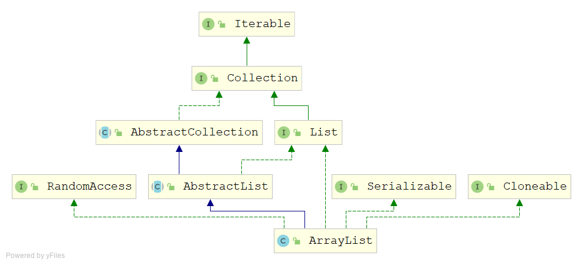
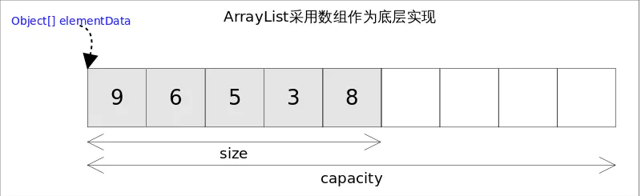

# ArrayList源码解析

## 类声明

```java
public class ArrayList<E> extends AbstractList<E>
        implements List<E>, RandomAccess, Cloneable, java.io.Serializable
```

ArrayList 实现了 List 接口，是顺序容器，即元素存放的数据与放进去的顺序相同，允许放入`null`元素。

ArrayList 实现了`RandomAccess`，说明 ArrayList 支持随机下标访问。



## 成员对象

```java
//默认的容量为10
private static final int DEFAULT_CAPACITY = 10;

private static final Object[] EMPTY_ELEMENTDATA = {};

private static final Object[] DEFAULTCAPACITY_EMPTY_ELEMENTDATA = {};

//核心，用于存放数据的对象数组
transient Object[] elementData; 

//集合元素的个数
private int size;

//记录这个list结构修改的次数
protected transient int modCount = 0;
```



## 构造器

```java
//通过参数指明初始化数组的长度
public ArrayList(int initialCapacity) {
    if (initialCapacity > 0) {
        this.elementData = new Object[initialCapacity];
    } else if (initialCapacity == 0) {
        this.elementData = EMPTY_ELEMENTDATA;
    } else {
        throw new IllegalArgumentException("Illegal Capacity: " + initialCapacity);
    }
}
//按默认的容量初始化数组
public ArrayList() {
    this.elementData = DEFAULTCAPACITY_EMPTY_ELEMENTDATA;
}

public ArrayList(Collection<? extends E> c) {
    elementData = c.toArray();
    if ((size = elementData.length) != 0) {        
        if (elementData.getClass() != Object[].class)
            elementData = Arrays.copyOf(elementData, size, Object[].class);
    } else {
        this.elementData = EMPTY_ELEMENTDATA;
    }
}
```

ArrayList有三个构造器，可以指定初始化数组长度调用`ArrayList(int initialCapacity)`;如果调用无参构造器，会初始化一个空的数组，当第一次`add()`的时候会扩容到默认容量大小（10）；还有一个构造器可以传入一个集合，将其中的元素复制到这个新创建的ArrayList中。

## 扩容机制

### 自动扩容

```java
public boolean add(E e) {
    ensureCapacityInternal(size + 1);  // Increments modCount!!
    elementData[size++] = e;
    return true;
}

private void ensureCapacityInternal(int minCapacity) {
    ensureExplicitCapacity(calculateCapacity(elementData, minCapacity));
}

private static int calculateCapacity(Object[] elementData, int minCapacity) {
    if (elementData == DEFAULTCAPACITY_EMPTY_ELEMENTDATA) {
        return Math.max(DEFAULT_CAPACITY, minCapacity);
    }
    return minCapacity;
}

private void ensureExplicitCapacity(int minCapacity) {
    modCount++;
    // overflow-conscious code
    if (minCapacity - elementData.length > 0)
        grow(minCapacity);
}
```

 当ArrayList在调用`add()`方法的时候，会先检查`size + 1`有没有超过数组容量。如果超过`最小所需容量`超过当前对象数组的长度，则触发扩容，即是调用`grow()`方法。

```java
private void grow(int minCapacity) {
    // overflow-conscious code
    int oldCapacity = elementData.length;
    int newCapacity = oldCapacity + (oldCapacity >> 1);
    if (newCapacity - minCapacity < 0)
        newCapacity = minCapacity;
    if (newCapacity - MAX_ARRAY_SIZE > 0)
        newCapacity = hugeCapacity(minCapacity);
    // minCapacity is usually close to size, so this is a win:
    elementData = Arrays.copyOf(elementData, newCapacity);
}
```

其中，最关键的语句就是`int newCapacity = oldCapacity + (oldCapacity >> 1);`，这个语句计算出扩容后的数组长度。右移运算符相当于$oldCapacity /(2^1)$，即是扩容后的容量是原来容量的`1.5`倍。


上面提到的`add()` 方法是无参数的方法，直接将元素插入到末尾中。它有个重载函数，能够指定位置插入元素。

```java
public void add(int index, E element) {
    rangeCheckForAdd(index);

    ensureCapacityInternal(size + 1);  // Increments modCount!!
    System.arraycopy(elementData, index, elementData, index + 1,size - index);
    elementData[index] = element;
    size++;
}
```

具体实现跟无参`add()`相似，主要是`System.arraycopy(elementData, index, elementData, index + 1,size - index);`，相当于将`index`后的元素整体后移一个位置，然后再`elementData[index] = element;`。

### 手动扩容

默认地，ArrayList会在当数组长度不够用的时候触发扩容。但是频繁的扩容会造成性能的下降，如果我们预先知道ArrayList要存放多少数据，通过构造函数来指定数组容量，或者手动调用扩容函数`ensureCapacity()`。

```java
public void ensureCapacity(int minCapacity) {
    int minExpand = (elementData != DEFAULTCAPACITY_EMPTY_ELEMENTDATA) ? 0 : DEFAULT_CAPACITY;

    if (minCapacity > minExpand) {
        ensureExplicitCapacity(minCapacity);
    }
}
```

通过手动调用扩容函数，会一次性的扩容到目标容量，避免频繁触发扩容机制。

## 移除元素

```java
public E remove(int index) {
    rangeCheck(index);

    modCount++;
    E oldValue = elementData(index);

    int numMoved = size - index - 1;
    if (numMoved > 0)
        System.arraycopy(elementData, index+1, elementData, index,numMoved);
    elementData[--size] = null; // clear to let GC do its work

    return oldValue;
}
```

移除元素的实现非常巧妙，大体思想是`把要移除的元素后面的元素整体向前移动一个位置`。

```java
public boolean remove(Object o) {
    if (o == null) {
        for (int index = 0; index < size; index++)
            if (elementData[index] == null) {
                fastRemove(index);
                return true;
            }
    } else {
        for (int index = 0; index < size; index++)
            if (o.equals(elementData[index])) {
                fastRemove(index);
                return true;
            }
    }
    return false;
}
```

重载函数通过元素来移除的方法实现方式就是`线性查找法`，查找到后快速删除，需要注意的是对象的比较是`equals`方法。

## 获取元素

```java
public E get(int index) {
    rangeCheck(index);
    return elementData(index);
}
```

获取元素的方法非常简单，因为ArrayList基于数组实现，也实现了`RandomAccess`接口，所以直接使用下标即可获取到元素，当然要先判断下标是否越界。

## 修改元素

```java
public E set(int index, E element) {
    rangeCheck(index);
    E oldValue = elementData(index);
    elementData[index] = element;
    return oldValue;
}
```

修改元素的方法也非常简单，判断数组下标没越界后直接用下标修改元素即可。

## 清空集合

```java
public void clear() {
    modCount++;

    // clear to let GC do its work
    for (int i = 0; i < size; i++)
        elementData[i] = null;

    size = 0;
}
```

清空集合，其实主要把size置为0即可，遍历元素置为null是为了gc回收。

## 总结

通过上面的源码分析可以知道：

- ArrayList基于数组实现，底层数据存放在`Object[] elementData`中。
- ArrayList实现`RandomAccess`接口，支持随机下标访问。
- `元素增删慢`，因为需要扩容和移动数组。
- `元素查改快`，因为可以使用下标访问。
- 元素可重复，可以为NULL。


------


# ArrayList线程安全的问题

## 为什么说ArrayList不是线程安全？

```java
public boolean add(E e) {
    ensureCapacityInternal(size + 1);  // Increments modCount!!
    elementData[size++] = e;
    return true;
}
```

- 数组越界问题

1. 列表大小为9，即size=9
2. 线程A开始进入add方法，这时它获取到size的值为9，调用ensureCapacityInternal方法进行容量判断。
3. 线程B此时也进入add方法，它获取到size的值也为9，也开始调用ensureCapacityInternal方法。
4. 线程A发现需求大小为10，而elementData的大小就为10，可以容纳。于是它不再扩容，返回。
5. 线程B也发现需求大小为10，也可以容纳，返回。
6. 线程A开始进行设置值操作， elementData[size++] = e 操作。此时size变为10。
7. 线程B也开始进行设置值操作，它尝试设置elementData[10] = e，而elementData没有进行过扩容，它的下标最大为9。于是此时会报出一个数组越界的异常`ArrayIndexOutOfBoundsException`。

- NULL值问题

`elementData[size++] = e`不是一个原子操作：

1. elementData[size] = e;
2. size = size + 1;

逻辑：

1. 列表大小为0，即size=0
2. 线程A开始添加一个元素，值为A。此时它执行第一条操作，将A放在了elementData下标为0的位置上。
3. 接着线程B刚好也要开始添加一个值为B的元素，且走到了第一步操作。此时线程B获取到size的值依然为0，于是它将B也放在了elementData下标为0的位置上。
4. 线程A开始将size的值增加为1
5. 线程B开始将size的值增加为2

这样线程AB执行完毕后，理想中情况为size为2，elementData下标0的位置为A，下标1的位置为B。而实际情况变成了size为2，elementData下标为0的位置变成了B，下标1的位置上什么都没有。并且后续除非使用set方法修改此位置的值，否则将一直为null，因为size为2，添加元素时会从下标为2的位置上开始。

## 如何解决线程安全问题

ArrayList -> Vector -> SynchronizedList -> CopyOnWriteArrayList

多线程环境下使用ArrayList 会发生线程安全问题，如下会抛出`java.util.ConcurrentModificationException`异常

```java
List<String> list = new ArrayList<>();
for (int i = 1; i <= 10; i++) {
    new Thread(() -> {
        list.add(UUID.randomUUID().toString().substring(0, 8));
        System.out.println(list);
    }, "Thread " + i).start();
}
```

方案1：使用`Vector`，[Vector为什么是线程安全的？](#vector)

```java
List<String> list = new Vector<>();
for (int i = 1; i <= 10; i++) {
    new Thread(() -> {
        list.add(UUID.randomUUID().toString().substring(0, 8));
        System.out.println(list);
    }, "Thread " + i).start();
}
```

方案2：使用`Collections.synchronizedList()`，[实现原理](#synchronizedList)

```java
List<String> list = Collections.synchronizedList(new ArrayList<>());
for (int i = 1; i <= 10; i++) {
    new Thread(() -> {
        list.add(UUID.randomUUID().toString().substring(0, 8));
        System.out.println(list);
    }, "Thread " + i).start();
}
```

方案3：使用`CopyOnWriteArrayList`，[CopyOnWriteArrayList是怎么实现线程安全的？](#CopyOnWriteArrayList)

```java
List<String> list = new CopyOnWriteArrayList<>();
for (int i = 1; i <= 10; i++) {
    new Thread(() -> {
        list.add(UUID.randomUUID().toString().substring(0, 8));
        System.out.println(list);
    }, "Thread " + i).start();
}
```

## <span id="vector">Vector为什么是线程安全的？</span>

Vector的实现跟ArrayList相似，它实现线程的方式是将所有方法加上`synchronized`关键字，包括`get()`、`indexOf()`和`contains`等这种非修改操作方法。这样会造成Vector的性能严重下降。

### 类声明

```java
public class Vector<E> extends AbstractList<E>
    implements List<E>, RandomAccess, Cloneable, java.io.Serializable
```

### 成员对象

```java
//存放数据的对象数组
protected Object[] elementData;

//存放元素个数，相当于ArrayList的size
protected int elementCount;

//记录这个list结构修改的次数
protected int capacityIncrement;
```

### 构造器

```java
public Vector(int initialCapacity, int capacityIncrement) {
    super();
    if (initialCapacity < 0)
        throw new IllegalArgumentException("Illegal Capacity: " + initialCapacity);
    this.elementData = new Object[initialCapacity];
    this.capacityIncrement = capacityIncrement;
}

public Vector(int initialCapacity) {
    this(initialCapacity, 0);
}
//无参构造器默认初始化10长度
public Vector() {
    this(10);
}

public Vector(Collection<? extends E> c) {
    elementData = c.toArray();
    elementCount = elementData.length;
    // c.toArray might (incorrectly) not return Object[] (see 6260652)
    if (elementData.getClass() != Object[].class)
        elementData = Arrays.copyOf(elementData, elementCount, Object[].class);
}
```

### 增删改操作

都是给方法加上`synchronized`关键字实现线程安全

```java
//尾插增加元素
public synchronized boolean add(E e) {
    modCount++;
    ensureCapacityHelper(elementCount + 1);
    elementData[elementCount++] = e;
    return true;
}

//定位增加元素
public void add(int index, E element) {
    insertElementAt(element, index);
}

//删除元素
public boolean remove(Object o) {
    return removeElement(o);
}

public synchronized void insertElementAt(E obj, int index) {
    modCount++;
    if (index > elementCount) {
        throw new ArrayIndexOutOfBoundsException(index + " > " + elementCount);
    }
    ensureCapacityHelper(elementCount + 1);
    System.arraycopy(elementData, index, elementData, index + 1, elementCount - index);
    elementData[index] = obj;
    elementCount++;
}

public synchronized boolean removeElement(Object obj) {
    modCount++;
    int i = indexOf(obj);
    if (i >= 0) {
        removeElementAt(i);
        return true;
    }
    return false;
}

//修改元素
public synchronized E set(int index, E element) {
    if (index >= elementCount)
        throw new ArrayIndexOutOfBoundsException(index);

    E oldValue = elementData(index);
    elementData[index] = element;
    return oldValue;
}
```

### 查询操作

查询操作也加上了`synchronized`关键字

```java
public synchronized E get(int index) {
    if (index >= elementCount)
        throw new ArrayIndexOutOfBoundsException(index);
    return elementData(index);
}

public int indexOf(Object o) {
    return indexOf(o, 0);
}

public synchronized int indexOf(Object o, int index) {
    if (o == null) {
        for (int i = index ; i < elementCount ; i++)
            if (elementData[i]==null)
                return i;
    } else {
        for (int i = index ; i < elementCount ; i++)
            if (o.equals(elementData[i]))
                return i;
    }
    return -1;
}
```

## <span id="synchronizedList">同步列表synchronizedList</span>

`java.util.Collections`中提供了很多集合操作的工具方法，其中就有线程安全的，主要有这些方法：

```java
Collections. synchronizedCollection()
Collections. synchronizedList()
Collections. synchronizedSet()

Collections. synchronizedMap()

Collections. synchronizedSortedMap()
Collections. synchronizedSortedSet()
   
Collections. synchronizedNavigableMap()
Collections. synchronizedNavigableSet()
```

这些工具方法实现线程安全的原理就是使用一个内部类继承封装集合类，用`synchronized`关键字将原来集合相应的方法锁起来操作。以下抽取部分代码一睹真容：

```java
static class SynchronizedCollection<E> implements Collection<E>, Serializable {
    final Collection<E> c;  // Backing Collection
    //同步锁的对象
    final Object mutex;     // Object on which to synchronize

    SynchronizedCollection(Collection<E> c) {
        this.c = Objects.requireNonNull(c);
        mutex = this;
    }

    SynchronizedCollection(Collection<E> c, Object mutex) {
        this.c = Objects.requireNonNull(c);
        this.mutex = Objects.requireNonNull(mutex);
    }

    public int size() {
        synchronized (mutex) {return c.size();}
    }
    
    public boolean isEmpty() {
        synchronized (mutex) {return c.isEmpty();}
    }
    
    public boolean contains(Object o) {
        synchronized (mutex) {return c.contains(o);}
    }


    public boolean add(E e) {
        synchronized (mutex) {return c.add(e);}
    }
    public boolean remove(Object o) {
        synchronized (mutex) {return c.remove(o);}
    }
  
}
```

## <span id="CopyOnWriteArrayList">CopyOnWriteArrayList是怎么实现线程安全的</span>

### 写入时复制（Copy-On-Write）思想

写入时复制（CopyOnWrite，简称COW）思想是计算机程序设计领域中的一种优化策略。其核心思想是，如果有多个调用者（Callers）同时要求相同的资源（如内存或者是磁盘上的数据存储），他们会共同获取相同的指针指向相同的资源，直到某个调用者视图修改资源内容时，系统才会真正复制一份专用副本（private copy）给该调用者，而其他调用者所见到的最初的资源仍然保持不变。这过程对其他的调用者都是透明的（transparently）。此做法主要的优点是如果调用者没有修改资源，就不会有副本（private copy）被创建，因此多个调用者只是读取操作时可以共享同一份资源。

### 实现原理

> A thread-safe variant of {@link java.util.ArrayList} in which all mutative operations ({@code add}, {@code set}, and so on) are implemented by making a fresh copy of the underlying array.

CopyOnWriteArrayList类注释上说明，这是一个ArrayList的线程安全变种，在做写操作时候会重新复制一份数组。其实现线程安全的方式是通过`ReentrantLock`为写操作加锁实现的。

```Java
/** The lock protecting all mutators */
final transient ReentrantLock lock = new ReentrantLock();
```

CopyOnWriteArrayList的数据存放在`Object[] array`中，与ArrayList不同的是，CopyOnWriteArrayList是通过getter/setter来访问这个数组的。

```java
/** The array, accessed only via getArray/setArray. */
private transient volatile Object[] array;

final Object[] getArray() {
    return array;
}

final void setArray(Object[] a) {
    array = a;
}
```

写操作，删除操作类似

```java
public boolean add(E e) {
    final ReentrantLock lock = this.lock;
    //加锁
    lock.lock();
    try {
        Object[] elements = getArray();
        int len = elements.length;
        //写操作，复制新的数组
        Object[] newElements = Arrays.copyOf(elements, len + 1);
        newElements[len] = e;
        setArray(newElements);
        return true;
    } finally {
        lock.unlock();
    }
}
```

读操作，无需加锁

```java
private E get(Object[] a, int index) {
    return (E) a[index];
}

public E get(int index) {
    return get(getArray(), index);
}
```

### 优点

对于`读多写少`的数据，由于读操作是没有加锁的，这样能提高程序在并发情况下的访问性能。

### 缺点

这种实现方式只是保证数据的`最终一致性`，当在进行写操作复制数据还没替换的时候，其他线程读取到的仍是旧数据。

如果存放的数据对象比较大，频繁的复制替换会`消耗内存`，从而引发GC。