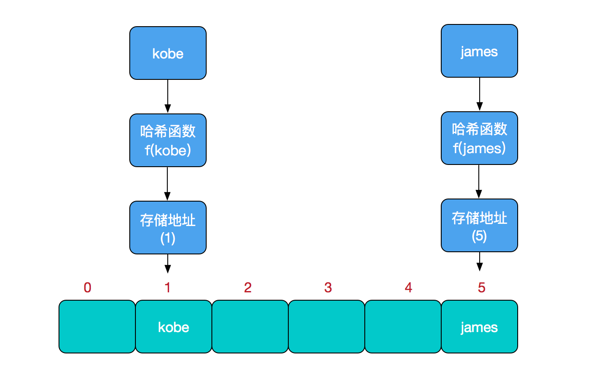
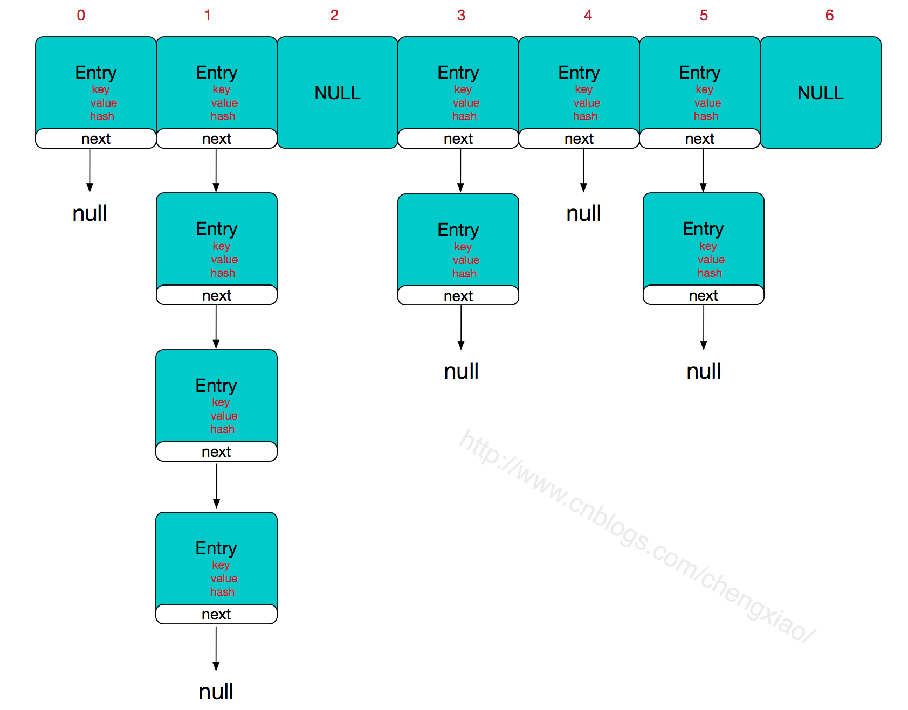

# HashMap实现原理及源码分析

`哈希表`（hash table）也叫`散列表`，是一种非常重要的数据结构。其应用场景及其丰富，许多缓存技术（比如memcached）的核心其实就是在内存中维护一张大的哈希表。而HashMap的实现原理也常常出现在各类的面试题中，重要性可见一斑。本文会对java集合框架中的对应实现HashMap的实现原理进行讲解。

## 什么是哈希表

在讨论哈希表之前，我们先大概了解下其他数据结构在新增，查找等基础操作执行性能

**数组**：采用一段连续的存储单元来存储数据。对于指定下标的查找，时间复杂度为O(1)；通过给定值进行查找，需要遍历数组，逐一比对给定关键字和数组元素，时间复杂度为O(n)，当然，对于有序数组，则可采用二分查找，插值查找，斐波那契查找等方式，可将查找复杂度提高为O(logn)；对于一般的插入删除操作，涉及到数组元素的移动，其平均复杂度也为O(n)。

**线性链表**：对于链表的新增，删除等操作（在找到指定操作位置后），仅需处理结点间的引用即可，时间复杂度为O(1)，而查找操作需要遍历链表逐一进行比对，复杂度为O(n)。

**二叉树**：对一棵相对平衡的有序二叉树，对其进行插入，查找，删除等操作，平均复杂度均为O(logn)。

**哈希表**：相比上述几种数据结构，在哈希表中进行添加，删除，查找等操作，性能十分之高，不考虑哈希冲突的情况下，仅需一次定位即可完成，时间复杂度为O(1)，接下来我们就来看看哈希表是如何实现达到惊艳的常数阶O(1)的。

我们知道，数据结构的物理存储结构只有两种：**顺序存储结构**和**链式存储结构**（像栈，队列，树，图等是从逻辑结构去抽象的，映射到内存中，也这两种物理组织形式），而在上面我们提到过，在数组中根据下标查找某个元素，一次定位就可以达到，哈希表利用了这种特性，**哈希表的主干就是数组**。

比如我们要新增或查找某个元素，我们通过把当前元素的关键字 通过某个函数映射到数组中的某个位置，通过数组下标一次定位就可完成操作。

**存储位置 = f(关键字)**

其中，这个函数f一般称为`哈希函数`，这个函数的设计好坏会直接影响到哈希表的优劣。举个例子，比如我们要在哈希表中执行插入操作：



查找操作同理，先通过哈希函数计算出实际存储地址，然后从数组中对应地址取出即可。

**哈希冲突**

然而万事无完美，如果两个不同的元素，通过哈希函数得出的实际存储地址相同怎么办？也就是说，当我们对某个元素进行哈希运算，得到一个存储地址，然后要进行插入的时候，发现已经被其他元素占用了，其实这就是所谓的`哈希冲突`，也叫哈希碰撞。

前面我们提到过，哈希函数的设计至关重要，好的哈希函数会尽可能地保证**计算简单**和**散列地址分布均匀**。但是，我们需要清楚的是，数组是一块连续的固定长度的内存空间，再好的哈希函数也不能保证得到的存储地址绝对不发生冲突。那么哈希冲突如何解决呢？哈希冲突的解决方案有多种：`开放定址法`（发生冲突，继续寻找下一块未被占用的存储地址），`再散列函数法`，`链地址法`，而HashMap即是采用了链地址法，也就是**数组+链表**的方式。

## HashMap实现原理

HashMap的主干是一个Entry数组。Entry是HashMap的基本组成单元，每一个Entry包含一个key-value键值对。

```java
//HashMap的主干数组，可以看到就是一个Entry数组，初始值为空数组{}
//主干数组的长度一定是2的次幂，至于为什么这么做，后面会有详细分析。
transient Entry<K,V>[] table = (Entry<K,V>[]) EMPTY_TABLE;
```

Entry是HashMap中的一个静态内部类。代码如下

```java
static class Entry<K,V> implements Map.Entry<K,V> {
    final K key;
    V value;
    Entry<K,V> next;//存储指向下一个Entry的引用，单链表结构
    int hash;//对key的hashcode值进行hash运算后得到的值，存储在Entry，避免重复计算

    Entry(int h, K k, V v, Entry<K,V> n) {
        value = v;
        next = n;
        key = k;
        hash = h;
   }
}
```

 所以，HashMap的整体结构如下



简单来说，HashMap由`数组+链表`组成的，数组是HashMap的主体，链表则是主要为了`解决哈希冲突`而存在的。

如果定位到的数组位置不含链表（当前entry的next指向null），那么对于查找，添加等操作很快，仅需一次寻址即可。

如果定位到的数组包含链表，对于添加操作，其时间复杂度为O(n)，首先遍历链表，存在即覆盖，否则新增。

对于查找操作来讲，仍需遍历链表，然后通过key对象的equals方法逐一比对查找。

所以，性能考虑，HashMap中的链表出现越少，性能才会越好。


**其他几个重要字段**

```java
//实际存储的键值对的个数
transient int size;

//阈值，当table == {}时，该值为初始容量（初始容量默认为16）
//当table被填充了，也就是为table分配内存空间后，threshold一般为 capacity*loadFactory
//HashMap在进行扩容时需要参考threshold，后面会详细谈到
int threshold;

//负载因子，代表了table的填充度有多少，默认是0.75
final float loadFactor;

//用于快速失败，由于HashMap非线程安全，在对HashMap进行迭代时，如果期间其他线程的参与导致HashMap的结构发生变化了（比如put，remove等操作），需要抛出异常ConcurrentModificationException
transient int modCount;
```


参考：[HashMap实现原理及源码分析](https://www.cnblogs.com/chengxiao/p/6059914.html)