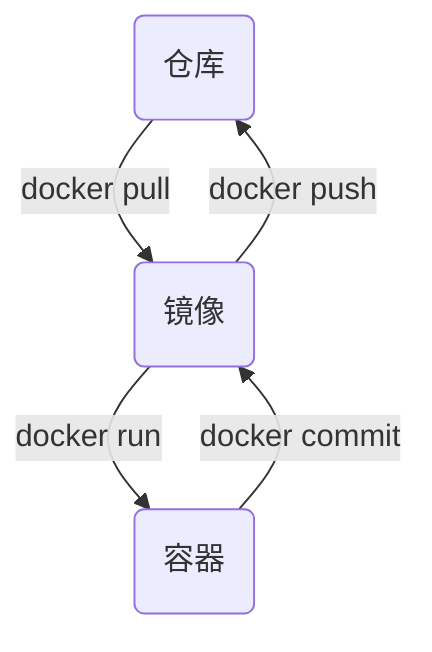
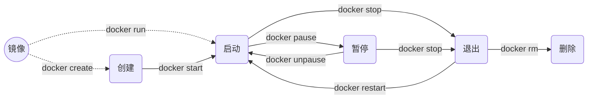

# 虚拟化容器技术：Docker

## 简介

## 安装Docker

在ubuntu下安装docker非常简单，只需要一条命令即可

```shell
sudo apt update
sudo apt install -y docker.io
```

> apt安装的已经自动设置为开机自启

在centos7中使用可以使用以下命令

```shell
sudo yum update                 
sudo yum install –y docker
sudo systemctl enable docker
sudo systemctl start docker

#上面命令安装的docker版本是1.13.1 安装最新发行版使用以下命令
yum install -y yum-utils  device-mapper-persistent-data lvm2
yum-config-manager --add-repo https://download.docker.com/linux/centos/docker-ce.repo
yum install -y docker-ce
```

由于在linux下我们一般不是使用root账号登录，运行docker会有权限问题，需要对当前用户赋予docker的权限

```shell
sudo groupadd docker             #创建docker用户组
sudo gpasswd -a $USER docker     #将当前用户加入docker用户组
newgrp docker                    #更新用户组权限
sudo service docker restart      #重启docker服务 使用 sudo systemctl restart docker 亦可
docker ps                        #测试用户是否可以使用
```

国内使用docker镜像下载资源会非常慢，需要使用阿里云的镜像源。首先打开阿里云镜像加速器 <https://cr.console.aliyun.com/cn-qingdao/instances/mirrors> ，获取自己的加速器地址，然后按照上面提示修改 /etc/docker/daemon.json文件。还可参考[https://www.daocloud.io/mirror#accelerator-doc](https://www.daocloud.io/mirror#accelerator-doc)

```shell
{
  "registry-mirrors": ["https://xxxx.mirror.aliyuncs.com"] 
   #这里替换成自己的加速器地址，因为这也是一个私服地址，每个人都是不同的
}
```

配置完成后记得重启一下docker

```shell
sudo systemctl daemon-reload
sudo systemctl restart docker
```

## Docker的基本使用

在docker中，有三个核心的概念：镜像（Image）、容器（Container）和仓库（Repository）。这三个部分组成了docker的整个生命周期。如下图显示，容器由镜像实例化而来（docker run），镜像可以提交到仓库保存（docker push），仓库提供镜像给docker拉取（docker pull），运行的容器可以提交为镜像。



### 镜像

Docker镜像（Image）是一个文件系统，包含了我们运行程序所需的代码、依赖、环境配置、系统内核等。

玩过VMware的应该都知道，我们在安装虚拟机之前需要准备一个系统镜像iso文件，docker中的镜像也类似于虚拟机中的镜像文件，是容器实例的“模版”。

#### 搜索仓库中的镜像

例如要搜索Tomcat，输入以下命令，就可以得到相关结果

```shell
docker search tomcat
```

不过在命令行中搜索镜像使用起来不是很方便，我建议还是使用docker官方仓库网站<https://hub.docker.com/>来搜索。

#### 查看本地所有镜像

```shell
docker images
```

### 容器

Docker容器（Container）是由镜像实例化出来的一个“子系统”，包括了root用户权限、进程空间、用户空间和网络空间，它类似于一个沙盘，容器之间互相隔离，互不影响。

容器的生命周期包括创建、启动、暂停、停止、重启、删除。需要注意的是，容器一旦被删除，里面的数据也会随之消失。如果要保存其中数据，可以通过容器数据卷或者提交容器成为镜像来实现。生命周期如下图所示：



#### 创建容器

创建一个状态为“创建”的容器，但并没有被启动。

```shell
docker create --name my-redis -p 6379:6379 redis:3.2
```

> 语法格式为 docker create [可选参数] 镜像名称:镜像tag 其中镜像tag可以省略，如果省略，则使用默认的latest
>
> --name 指定这个容器的名称
>
> -p 指定端口映射，用于在外部访问容器 格式为： 主机端口:容器内端口

#### 查看容器

可以看到一个status为Created名字为my-redis的容器，这里就不展示了，自己去实践一下。

```shell
docker ps -a
```

输入`docker ps --help`查看`docker ps`命令的可用参数

> -a 显示所有容器（包括刚创建、已经停止的等），不带此参数只显示运行中的
>
> -q 只返回容器id，可用于对容器操作场景

#### 启动容器

刚刚创建一个“创建”状态的容器，并没有启动，现在我们来启动它，然后再`docker ps`查看my-redis的status已经变成up。

```shell
docker start my-redis #通过容器名称或者容器ID启动容器
```

#### 创建并启动容器

最开始学docker时候就接触的这条命令，也是最常用的命令之一

```shell
 docker run -d --name mysql -p 3306:3306 -e MYSQL_ROOT_PASSWORD=123456 mysql:5.7
```

> -d 后台运行
> -e 指定容器的环境变量，这里的mysql镜像通过这个环境变量设置root的密码，具体看镜像介绍
>
> -v 挂载容器数据卷，将容器内数据保存到宿主机，例：-v /data:/data 宿主机路径:容器内路径
>
> --add-host 给容器添加host
>
> -it 交互方式进入

#### 停止容器

```shell
docker stop my-redis #对容器的操作都可以通过名字或者ID
```

#### 重启容器

```
docker restart my-redis
```

#### 删除容器

```
docker rm my-redis
```

#### 显示容器内正在运行的进程

```
docker top mysql
```

### 仓库

Docker仓库（Repository）是集中存放镜像文件的地方，仓库中可以保存不同的镜像，不同版本的同种镜像。目前，最大的公开仓库就是docker官方仓库<https://hub.docker.com/>，可以在上面注册账号并推送自己的镜像上去。如果用户不希望自己的镜像公开分享，可以在本地创建私有注册服务器来创建一个本地仓库。此外，阿里云也提供了个人的私服，就是上面提到的那个阿里云加速器，具体参照阿里云加速器文档。

#### 创建本地私服

```shell
docker run -d -v /data/docker-registry:/var/lib/registry -p 5000:5000 --restart=always --name registry registry:2
```

> -d表示后台运行
> -v挂载容器数据卷，作数据持久化
> -p开放端口映射，可以在宿主机访问
> --restart=always设置docker启动时候就启动这个容器，即开机自启

在多机公用一个私服的时候，建议添加一个host来配置私服

修改`/etc/hosts`文件 添加一行 

```shell
192.168.149.133 docker-registry #此处ip修改为自己的局域网ip
```

在所有使用这个私服的机子中，修改`/etc/docker/daemon.json`文件，添加私服地址

```json
"insecure-registries":["docker-registry:5000"]
```

#### 推送到仓库

创建一个镜像并推送到私服中，这里使用busybox做演示，并未真正“创建”一个新的镜像，只是修改Tag

```shell
docker pull busybox
docker tag busybox:latest docker-registry:5000/zhanjixun/my-busybox:1.0
docker push docker-registry:5000/zhanjixun/my-busybox:1.0
```

> 语法格式：docker push  私服名称:私服端口/用户名/推入镜像名称:镜像版本标签
> 如果是推送到docker hub官方仓库docker.io，则可以省略 私服名称:私服端口

## 进一步使用

容器通常都是运行一些中间件或者我们的代码项目的，前面介绍了如何运行启动容器。那么，一旦容器运行起来，我们如何控制和管理容器呢？比如如何查看容器运行日志，如何在容器内执行命令。下面介绍

### 查看容器日志

这里查看的只是容器内控制台的输出内容，如果一些日志是打印在文件里面的，还需要去文件内查看。

```shell
docker logs -ft --tail=1000 容器名称/容器ID
```

> -f 表示跟踪日志输出
> -t 显示时间戳
> --tail 末尾n行

### 在容器内执行命令

容器相当于一个“子系统”，那么如果想要在其中运行命令行该如何操作呢，请看以下代码

```shell
docker exec my-redis date
docker exec mysql ls /
docker exec -it my-redis /bin/bash
```

> exec指令是在容器内执行命令的用法 格式 docker exec 容器名称/容器ID 执行的命令
> -it 表示以交互方式进入容器 /bin/bash是shell解析器 有些容器的解析器是/bin/sh
> 进入容器后终端的命令行就变成了容器的终端了，输入命令即可操作容器，输入exit退出交互

### 安装可视化界面Portainer

容器在docker中运行，经常需要对其管理，总是面对命令行终端显得有点枯燥。为了更好更方便的管理和使用docker，使用可视化的管理工具似乎更符合人的习惯。下面演示如何在docker中安装portainer。

```shell
docker run -d --name portainer \
-p 9000:9000 --restart always \
-v /var/run/docker.sock:/var/run/docker.sock \
-v /data/portainer:/data \
portainer/portainer:latest
```

> /var/run/docker.sock挂载这个数据卷是因为要在容器内部访问docker
> portainer的数据都存放在/data目录下，容器数据卷我选择挂载到/data/portainer下，做数据持久化

安装完后，浏览器打开地址 [http://localhost:9000](http://localhost:9000) 按照提示设置密码，docker选择Local的就行了。

在左边菜单栏，看到Stacks、Containers、Images、Networks和Volumes，每个功能可以自己点一下，玩几下就熟悉了。

### 常用镜像的使用方式

#### MySQL

详情参照docker hub  <https://hub.docker.com/_/mysql>

```shell
docker run -d --name mysql mysql:5.7
```

> -e MYSQL_ROOT_PASSWORD=123456          #设置mysql的root用户的密码
>
> -v /data/config/mysql:/etc/mysql/conf.d      #配置自己的mysql配置数据卷
>
> -v /data/mysql:/var/lib/mysql                        #数据库所有数据信息文件
>
> -e MYSQL_DATABASE=db_name                    #初始化时候创建的数据库

#### Tomcat

详情参照docker hub <https://hub.docker.com/_/tomcat>


## 使用Dockerfile自定义镜像


## Docker三剑客之一：Docker Compose

在前面的介绍中，对容器的操作都是单个的，但是在现实的项目中，尤其是分布式或微服务的项目，我们通常都是要启动很多个容器的，如果每一个容器都要手动启动停止，那管理效率之低，维护成本之高可想而知了。

在这种情况下，使用Docker Compose可以轻松、高效的管理容器，它是基于docker api开发的用来定义一组容器(服务)的应用工具。

Docker Compose并不是docker官方提供的工具，但是也是一个优秀的工具，它使用python开发，要享受Docker Compose带来的便利，需要额外安装它。

### 安装Docker Compose

```shell
sudo apt install docker-compose
```

### Docker Compose语法

在Docker Compose中，使用`docker-compose.yml`文件定义一组服务。先看一个例子

```yaml
version: "3"
services:
  db-mysql:
    image: mysql:5.7
    environment:
      - MYSQL_ROOT_PASSWORD=123456
```

### 使用Docker Compose部署Dubbo分布式项目


## Docker三剑客之一：Docker Swarm

Docker Swarm是一个Docker的编排工具，前面介绍的Docker Compose是用来编排容器的，这里Docker Swarm用来管理Docker集群，其主要的作用就是把若干台Docker主机抽象成一个整体，通过统一的管理调配Docker主机上的Docker资源。参考官网：[https://docs.docker.com/engine/swarm/](https://docs.docker.com/engine/swarm/)

### Docker Swarm集群搭建

Docker Swarm通过Docker API把各个Docker主机连接起来，被连接的某个主机成为节点。按节点角色分，可分为管理节点（manger）和工作节点（worker）。下面通过2台ubuntu Docker环境演示如何搭建集群，基本信息如下：

> ubuntu-manger 192.168.197.128
>
> ubuntu-worker 192.168.197.131

首先需要设置各个节点的主机名称，并确定ip地址

```shell
hostnamectl set-hostname ubuntu-manger #在管理节点运行
hostnamectl set-hostname ubuntu-worker #在工作节点运行
hostnamectl                            #查看主机名称
```

#### 初始化管理节点

```shell
docker swarm init
```

> Swarm initialized: current node (s750sab8tte49cksp16pk5ptr) is now a manager.
>
> To add a worker to this swarm, run the following command:
>
> docker swarm join --token SWMTKN-1-41x7s99e8ojwizkqrqpjq1l314aba59zk3ye1lliquyfurizc9-9ipi8elm1nklpi6j70ut0o51m 192.168.197.128:2377
>
> To add a manager to this swarm, run 'docker swarm join-token manager' and follow the instructions.

按照上面提示，将中间的命令复制到工作节点执行则可加入集群。如果不小心忘记了加入集群的命令可以通过以下命令查看。

```shell
docker swarm join-token worker   #查看以工作节点角色加入的命令
docker swarm join-token manager  #查看以管理节点角色加入的命令
```

#### 查看集群所有节点

```shell
docker node ls
```

| ID                          | HOSTNAME      | STATUS | AVAILABILITY | MANAGER STATUS | ENGINE VERSION |
| --------------------------- | ------------- | ------ | ------------ | -------------- | -------------- |
| s750sab8tte49cksp16pk5ptr * | ubuntu-manger | Ready  | Active       | Leader         | 18.09.7        |
| 9vlcp6tk40kjwdn2zw9xsmj4h   | ubuntu-worker | Ready  | Active       |                | 18.09.7        |

#### 在集群中运行服务


####  集群下安装可视化界面Portainer

```shell
docker service create \
--replicas 1 \
--name portainer \
--publish 9000:9000 \
--constraint 'node.role == manager' \
--mount type=bind,src=/var/run/docker.sock,dst=/var/run/docker.sock \
--mount type=bind,src=/data/portainer,dst=/data \
portainer/portainer:latest
```

> --replicas  表示运行的服务个数，可以动态修改进行缩扩容
>
> --publish 9000:9000  端口映射，在swarm中部署的服务，在所有的节点机器上的端口都可以映射上，如访问的节点不是具体运行的节点，会转发到具体运行的节点
>
> --mount 绑定数据卷

#### docker swarm中使用compose