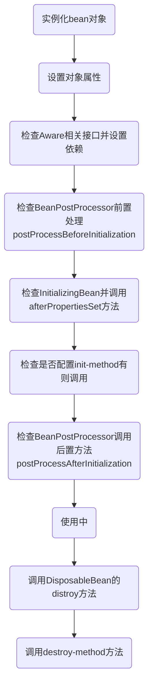

# Bean的生命周期

```mermaid
graph TD

a(实例化bean对象) --> b(设置对象属性) --> c(检查Aware相关接口并设置依赖) --> d(检查BeanPostProcessor前置处理postProcessBeforeInitialization) --> e(检查InitializingBean并调用afterPropertiesSet方法) --> f(检查是否配置init-method有则调用) --> g(检查BeanPostProcessor调用后置方法postProcessAfterInitialization) --> h(使用中) --> i(调用DisposableBean的distroy方法) --> j(调用destroy-method方法)
```
