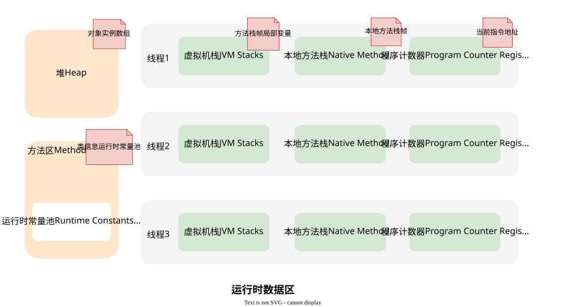

# JVM

## 内存模型

| 区域       | 线程共享 | 作用                     | 异常类型               |
| ---------- | -------- | ------------------------ | ---------------------- |
| 程序计数器 | 私有     | 记录当前指令地址         |                        |
| 虚拟机栈   | 私有     | 方法栈帧、局部变量       | StackOverflowError/OOM |
| 本地方法栈 | 私有     | native方法栈帧           | StackOverflowError/OOM |
| 堆         | 共享     | 存储对象实例、数组       | OutOfMemoryError       |
| 方法区     | 共享     | 类信息、常量池、静态变量 | OutOfMemoryError       |

JVM 内存区域也称为**运行时数据区域**，这些数据区域包括`程序计数器`、`虚拟机栈`、`本地方法栈`、`堆`、`方法区`。其中，运行时数据区的**程序计数器、虚拟机栈、本地方法栈属于每个线程私有的区域；堆和方法区属于所有线程间共享的区域**。

### 内存参数命令

#### 堆内存

1）`-Xms`：设置堆的最小空间大小，此值必须是 1024 的倍数且大于 1 MB。附加字母 k 或 k 表示千字节，m 或 m 表示兆字节，g 或 g 表示千兆字节，其它命令参数同理。比如`-Xms1024m`，表示堆的最小内存为`1024M`，默认值为物理内存的`1/64`。

2）`-Xmx`：设置堆的最大空间大小，此值必须是 1024 的倍数且大于 2 MB。比如`-Xmx2048m`，表示堆最大内存为`2G`，默认值为物理内存的`1/4`。对于服务器部署，`-Xms`和`-Xmx`通常建议设置为相同的值，以避免堆的内存空间频繁扩缩。

3）`-XX:+HeapDumpOnOutOfMemoryError`：表示可以让虚拟机在出现内存溢出异常时 Dump 出当前的堆内存转储快照。

#### 虚拟机栈

1）`-Xss`：设置每个线程的栈大小，比如`-Xss1024k`，表示每个线程的堆栈空间大小为`1024KB`，通常不需要我们调整设置，默认值取决于平台。

2）`-Xoss` ：设置每个线程中的本地方法栈大小，比如`-Xoss128k`，表示每个线程中的本地方法栈大小为`128KB`，不过 HotSpot 并不区分虚拟机栈和本地方法栈，因此对于 HotSpot 来说这个参数是无效的。

## 垃圾回收

JVM的垃圾回收（Garbage Collection, GC）机制是自动管理内存的核心功能，用于回收不再使用的对象以释放内存，防止内存泄漏。

### 哪些内存需要回收

垃圾回收主要针对**堆（Heap）**和**方法区（元空间/永久代）**：

1. 堆：分为新生代（Young Generation）和老年代（Old Generation）
   - 新生代：存放新创建的对象，进一步分为：
     1. Eden区：对象初次分配的区域
     1. Survivor区（From/To）：存放经过Minor GC后存活的对象
   - 老年代：存放长期存活的对象（经过多次Minor GC仍存活的对象）
2. 方法区：存储类信息、常量等，垃圾回收主要针对废弃的常量和类

**程序计数器、虚拟机栈和本地方法栈**的生命周期是随线程而生，随线程而灭的

### 判断对象存活的方法

#### 引用计数法

给对象中添加一个引用计数器，每当有一个地方引用它，计数器就加 1；当引用失效，计数器就减 1；任何时候计数器为 0 的对象就是不可能再被使用的。因为无法解决循环引用的问题，Java没有采用这种算法。

- 优点：实现简单，回收垃圾的效率高
- 缺点：1、循环引用无法回 2、收引用计数器开销大

#### 可达性分析法

从`GC Roots`节点出发，遍历对象引用链。无法被访问的对象标记为可回收

##### 哪些对象可以作为GC Roots

- 虚拟机栈（栈帧中的本地变量表）中引用的对象
- 本地方法栈中JNI（即一般说的 Native 方法）引用的对象
- 方法区中类静态属性引用的对象（如类中使用的static声明的引用类型字段）
- 方法区中常量引用的对象（如类中使用final声明的引用类型字段）

### 垃圾回收算法

https://mp.weixin.qq.com/s/kOUF07bMkEPRZDUiuiF_JA

## 类加载

 java代码编译后就会生成JVM能够识别的二进制文件*.class文件，将class文件加载到内存，最终成为可以被JVM直接使用的Java类型，这个过程叫做JVM的类加载机制。

### 类加载过程

class文件中的“类”从加载到JVM内存中，到卸载出内存过程有七个生命周期阶段：

类加载机制包括了前五个阶段，要注意的是加载、验证、准备、初始化、卸载的开始顺序是确定的，只是按顺序开始，进行与结束的顺序并不一定，解析阶段可能在初始化之后开始，另外，类加载无需等到程序中“首次使用”的时候才开始，JVM预先加载某些类也是被允许的。

### 类加载器

#### 双亲委派模型

双亲委派模型的工作过程如下：

首先，检查一下指定名称的类是否已经加载过，如果加载过了，就不需要再加载，直接返回。
如果此类没有加载过，那么，再判断一下是否有父加载器；如果有父加载器，则由父加载器加载，如果没有父类（扩展类没有父类），调用根类加载器来加载。
如果父加载器及根类加载器类加载器都没有找到指定的类，那么调用当前类加载器的findClass方法来完成类加载。

##### 为什么要设计双亲委派机制？

- 沙箱安全机制

  > 自己写的java.lang.String.class类不会被加载，这样便可以防止核心API库被随意篡改

- 避免类的重复加载

  > 当父亲已经加载了该类时，就没有必要子ClassLoader再加载一次，保证被加载类的`唯一性`
  
  https://blog.csdn.net/BarackYoung/article/details/137060856

## 调试经验