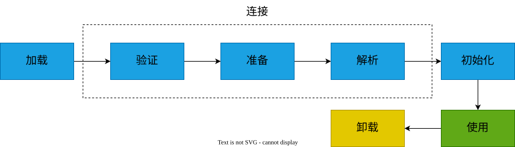
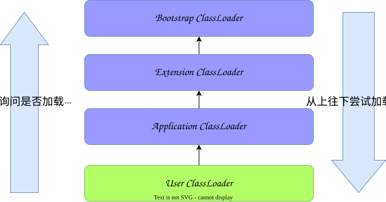

# JVM类加载机制

 java代码编译后就会生成JVM能够识别的二进制文件*.class文件，将class文件加载到内存，最终成为可以被JVM直接使用的Java类型，这个过程叫做JVM的类加载机制。

## 类加载过程

class文件中的“类”从加载到JVM内存中，到卸载出内存过程有七个生命周期阶段：

类加载机制包括了前五个阶段，要注意的是加载、验证、准备、初始化、卸载的开始顺序是确定的，只是按顺序开始，进行与结束的顺序并不一定，解析阶段可能在初始化之后开始，另外，类加载无需等到程序中“首次使用”的时候才开始，JVM预先加载某些类也是被允许的。

## 类加载器

## 双亲委派模型

双亲委派模型的工作过程如下：

首先，检查一下指定名称的类是否已经加载过，如果加载过了，就不需要再加载，直接返回。
如果此类没有加载过，那么，再判断一下是否有父加载器；如果有父加载器，则由父加载器加载，如果没有父类（扩展类没有父类），调用根类加载器来加载。
如果父加载器及根类加载器类加载器都没有找到指定的类，那么调用当前类加载器的findClass方法来完成类加载。

### 为什么要设计双亲委派机制？

- 沙箱安全机制

  > 自己写的java.lang.String.class类不会被加载，这样便可以防止核心API库被随意篡改

- 避免类的重复加载

  > 当父亲已经加载了该类时，就没有必要子ClassLoader再加载一次，保证被加载类的`唯一性`