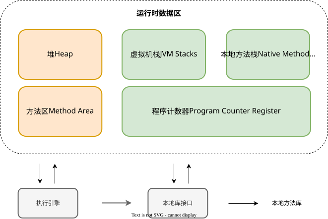

## JVM运行时数据区

## 运行时数据区

| 区域       | 线程共享 | 作用                     | 异常类型               |
| ---------- | -------- | ------------------------ | ---------------------- |
| 程序计数器 | 私有     | 记录当前指令地址         |                        |
| 虚拟机栈   | 私有     | 方法栈帧、局部变量       | StackOverflowError/OOM |
| 本地方法栈 | 私有     | native方法栈帧           | StackOverflowError/OOM |
| 堆         | 共享     | 存储对象实例、数组       | OutOfMemoryError       |
| 方法区     | 共享     | 类信息、常量池、静态变量 | OutOfMemoryError       |

JVM 内存区域也称为**运行时数据区域**，这些数据区域包括`程序计数器`、`虚拟机栈`、`本地方法栈`、`堆`、`方法区`。其中，运行时数据区的**程序计数器、虚拟机栈、本地方法栈属于每个线程私有的区域；堆和方法区属于所有线程间共享的区域**。

## 内存参数命令

#### 堆内存

1）`-Xms`：设置堆的最小空间大小，此值必须是 1024 的倍数且大于 1 MB。附加字母 k 或 k 表示千字节，m 或 m 表示兆字节，g 或 g 表示千兆字节，其它命令参数同理。比如`-Xms1024m`，表示堆的最小内存为`1024M`，默认值为物理内存的`1/64`。

2）`-Xmx`：设置堆的最大空间大小，此值必须是 1024 的倍数且大于 2 MB。比如`-Xmx2048m`，表示堆最大内存为`2G`，默认值为物理内存的`1/4`。对于服务器部署，`-Xms`和`-Xmx`通常建议设置为相同的值，以避免堆的内存空间频繁扩缩。

3）`-XX:+HeapDumpOnOutOfMemoryError`：表示可以让虚拟机在出现内存溢出异常时 Dump 出当前的堆内存转储快照。

#### 虚拟机栈

1）`-Xss`：设置每个线程的栈大小，比如`-Xss1024k`，表示每个线程的堆栈空间大小为`1024KB`，通常不需要我们调整设置，默认值取决于平台。

2）`-Xoss` ：设置每个线程中的本地方法栈大小，比如`-Xoss128k`，表示每个线程中的本地方法栈大小为`128KB`，不过 HotSpot 并不区分虚拟机栈和本地方法栈，因此对于 HotSpot 来说这个参数是无效的。

参考：

[JVM之内存管理](https://blog.csdn.net/m0_52963553/article/details/129204593)