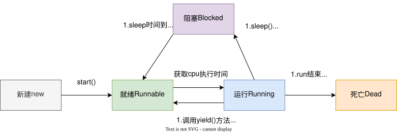

# Java多线程

## 多线程的概念

为什么使用多线程？

## 线程的创建方式

1. 继承Thread 
2. 实现Runnable 
3. 实现Callable

## 线程的状态

## 线程调度

### 状态控制

- sleep 使线程进入阻塞状态，睡眠时间到后回到就绪状态
- yield 放弃cpu时间片，使线程进入就绪状态
- join  在一个线程中调用另一个线程的join方法，当前线程就会等待目标线程执行完才继续执行

### 线程中断 

interrupt 配合Thread.currentThread().isInterrupted()主动在run代码中中断线程

## 锁

在多线程环境中，当多个线程同时访问共享资源时，可能会导致数据不一致。Java提供了`synchronized`关键字来解决这个问题，它通过锁机制确保同一时刻只有一个线程可以执行被保护的代码。在Java中，锁主要分为两种：`对象锁`和`类锁`。

### 对象锁

对象锁是Java中最常见的锁类型，它锁定的是特定的对象实例。当一个线程获取了某个对象的锁后，其他线程必须等待这个线程释放锁后才能获取该对象的锁。 对象锁的获取方式有两种：

1. 同步实例方法：synchronized修饰非静态方法
2. 同步代码块：synchronized(this)或synchronized(实例对象)

> **提示：** 对象锁只对同一个对象实例有效。如果创建了多个对象实例，每个实例都有自己的对象锁，不同实例的锁互不干扰。

### 类锁

类锁是Java中另一种重要的锁类型，它锁定的是类而不是对象实例。无论创建了多少个实例，一个类只有一个类锁。当一个线程获取了某个类的类锁后，其他线程必须等待这个线程释放锁后才能获取该类的类锁。 类锁的获取方式有两种：

1. 同步静态方法：synchronized修饰静态方法
2. 同步代码块：synchronized(类名.class)

> **提示**： 类锁实际上是锁定类的Class对象。在Java中，无论一个类有多少个对象实例，这个类只有一个Class对象，所以类锁也只有一个

### synchronized的底层实现原理

synchronized的底层实现是基于Monitor（监视器）机制。在Java虚拟机中，每个对象都有一个与之关联的Monitor。当线程执行到synchronized代码块时，会尝试获取Monitor的所有权：

如果Monitor没有被占用，线程获取Monitor的所有权并继续执行 如果Monitor已被其他线程占用，当前线程会被阻塞，进入Monitor的等待队列。

### 死锁

线程死锁是指由于两个或者多个线程互相持有对方所需要的资源，导致这些线程处于等待状态，无法前往执行。当线程进入对象的synchronized代码块时，便占有了资源，直到它退出该代码块或者调用wait方法，才释放资源，在此期间，其他线程将不能进入该代码块。当线程互相持有对方所需要的资源时，会互相等待对方释放资源，如果线程都不主动释放所占有的资源，将产生死锁。若无外力作用，它们都将无法推进下去。

产生死锁必须满足以下**4个条件**：

- **互斥条件**：一个资源每次只能被一个进程使用。
- **请求与保持条件**：一个进程因请求资源而阻塞时，对已获得的资源保持不放。
- **不剥夺条件**：进程已获得的资源，在末使用完之前，不能强行剥夺。
- **循环等待条件**：若干进程之间形成一种头尾相接的循环等待资源关系。

解决方案：

- 按固定顺序获取锁：确保所有线程按照相同的顺序获取锁，可以避免循环等待
- 加锁超时：设定获取锁的超时时间，超时后放弃当前锁并重试（不过synchronized不支持超时，需要使用Lock接口及其实现类）
- 死锁检测：使用工具（如jstack）检测死锁并强制解决

## 线程间通信

synchronized ：wait notify/notifyAll
				这两个方法必须在synchronized中使用，其实就是锁的方法
				notify唤醒等待的线程，如果有多个则随机唤醒一个
				wait会立即释放锁并开始等待；notify后不会马上释放锁，而是等到同步方法执行完才释放；被唤醒的线程需要重新竞争锁
				虚假唤醒：线程在调用wait方法后，没有其他线程notify显式唤醒，自己从等待状态返回
			Lock Condition：await signal/signalAll

## 