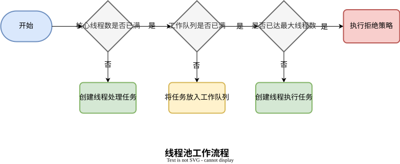

# Java线程池的使用


## 为什么要使用线程池

避免频繁地创建和销毁线程，达到线程对象的重用。

## 线程池工作流程



## 线程池的参数

ThreadPoolExecutor是线程池最核心的一个类，我们来看它参数最完整的构造类，代码如下：

```java
public ThreadPoolExecutor(int corePoolSize,//核心线程数
                          int maximumPoolSize,//最大线程数
                          long keepAliveTime,//空闲超时时间
                          TimeUnit unit,//超时时间单位
                          BlockingQueue<Runnable> workQueue,//工作队列
                          ThreadFactory threadFactory,//创建线程的工厂
                          RejectedExecutionHandler handler)//拒绝策略
```

| 参数              | 描述                                                         |
| ----------------- | ------------------------------------------------------------ |
| 核心线程数        | 线程池初始化的时候数量为0，当第一个任务到达时候创建corePoolSize个线程；核心线程永久存活，即使空闲也不会销毁。 |
| 最大线程数        | 当核心线程数已满，且工作队列也已存满，此时就会去判断当前线程数是否maximumPoolSize，如是则创建线程处理任务，如否则执行拒绝测量。 |
| 空闲超时时间/单位 | 如果当前线程数大于corePoolSize，且空闲线程超过keepAliveTime时间，则销毁线程。 |
| 工作队列          | 当核心线程已满，新提交的任务将放到工作队列中等待执行（前提是队列没满）。 |
| 创建线程的工厂    | 创建线程                                                     |
| 拒绝策略          | 线程数达到最大线程数，且工作队列已满，当提交新任务时候，则执行拒绝测量 |

## 工作队列

线程池使用的队列都是阻塞队列BlockingQueue，不同实现的区别主要看有界无界。

| 队列                | 界限                                                         |
| ------------------- | ------------------------------------------------------------ |
| SynchronousQueue    | 没有容量，提交任务后马上执行，如果线程已达最大，则执行拒绝策略 |
| LinkedBlockingQueue | 无参构造器是无界的，可以用有参构造器执行队列大小             |
| ArrayBlockingQueue  | 有界队列，创建对象时需指定队列大小                           |
| DealyQueue          | 无界，特点是元素有过期时间，到过期时间后，最早过期的先出队   |

## 拒绝策略

| 拒绝策略            | 描述                                           |
| ------------------- | ---------------------------------------------- |
| AbortPolicy         | 默认策略，直接抛出`RejectedExecutionException` |
| DiscardPolicy       | 丢弃任务，不抛出异常                           |
| DiscardOldestPolicy | 丢弃队列中最旧的任务，提交当前任务进队列       |
| CallerRunsPolicy    | 用调用者线程直接执行任务                       |

## 如何评估线程池的线程数量

**核心线程数**

CPU 密集型任务（如加密/解密、复杂算法、视频解码、压缩）：`核心线程数 ≈ CPU核心数 + 1`

IO 密集型任务（如数据库查询、HTTP 请求、文件读写）：`核心线程数 ≈ CPU核心数 * 2 `

>**CPU + 1**：为了提供CPU使用率并且减少不必要的切换
>
>**2 \* CPU**：为了填补空缺，因为线程经常在休息（等待 IO）

**最大线程数**

若任务突发性强，可设置为 `核心线程数 * 2~3`，需避免过高导致线程竞争或内存溢出

**工作队列**

| 队列类型                                | 队列实例 | 适用场景                                                     |
| --------------------------------------- | ---- | ------------------------------------------------------------ |
| 无界队列 |   `LinkedBlockingQueue`   | 适合任务量稳定且可控的场景，需警惕内存溢出OOM                |
| 有界队列 |   `ArrayBlockingQueue`   | 限制队列长度，避免 OOM，适用于稳定的业务流量；               |
| 同步移交队列  |  `SynchronousQueue`    | 任务不入队列，直接提交给线程池；适用于要求极低延迟、高吞吐量的场景（但可能造成任务丢失） |

**存活时间**

默认值：`60秒`（适合常规场景）

短任务场景可缩短（如10秒），长任务可延长

**拒绝策略**

| 拒绝策略            | 适用场景                                                     |
| ------------------- | ------------------------------------------------------------ |
| AbortPolicy（默认） | 直接抛出 RejectedExecutionException，适用于严格不允许丢任务的场景。 |
| CallerRunsPolicy    | 让提交任务的线程自己执行该任务，适用于降低任务提交速率。     |
| DiscardPolicy       | 直接丢弃任务，不抛异常（适用于不重要任务）。                 |
| DiscardOldestPolicy | 丢弃队列中最老的任务（适用于实时性高的任务）                 |

## 常见线程池类型


Executors提供了4种创建线程池的方式：


| 线程池                  | 参数                                                         | 队列                           | 特点                                                         | 适用场景                             |
| ----------------------- | ------------------------------------------------------------ | ------------------------------ | ------------------------------------------------------------ | ------------------------------------ |
| newFixedThreadPool      | corePoolSize = maxPoolSize = nThreads（固定线程数）          | 无界队列`LinkedBlockingQueue`  | 线程数量固定，无空闲线程回收                                 | 负载稳定的长期任务（如后台数据处理） |
| newCachedThreadPool     | corePoolSize = 0，maxPoolSize = Integer.MAX_VALUE（理论上无限扩容） | 同步移交队列`SynchronousQueue` | 线程数量弹性伸缩，空闲线程超时回收；新任务直接移交线程执行，无队列缓冲 | 适合短时异步任务                     |
| newSingleThreadExecutor | corePoolSize = maxPoolSize = 1（仅1个线程）                  | 无界队列`LinkedBlockingQueue`  | 任务严格按提交顺序执行（类似单线程）                         | 保证顺序执行                         |
| newScheduledThreadPool  | maxPoolSize = Integer.MAX_VALUE                              | 延迟队列`DelayedWorkQueue`     | 支持定时任务和周期性任务                                     | 支持定时/周期性任务                  |

