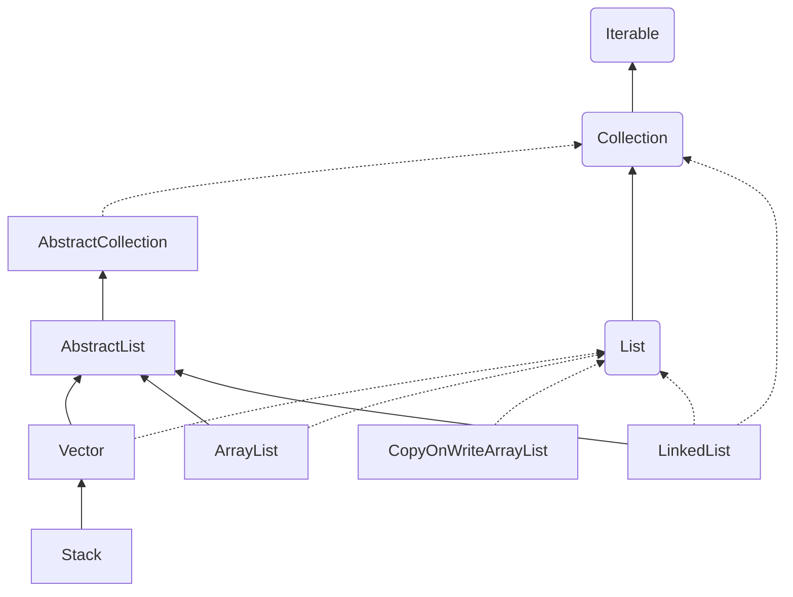
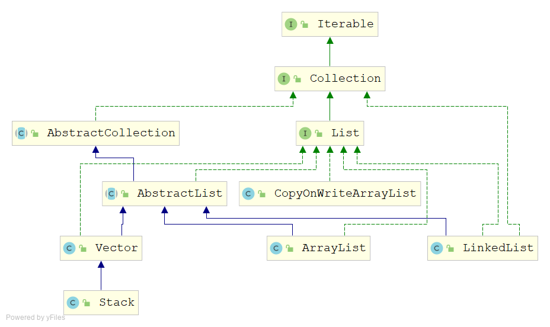
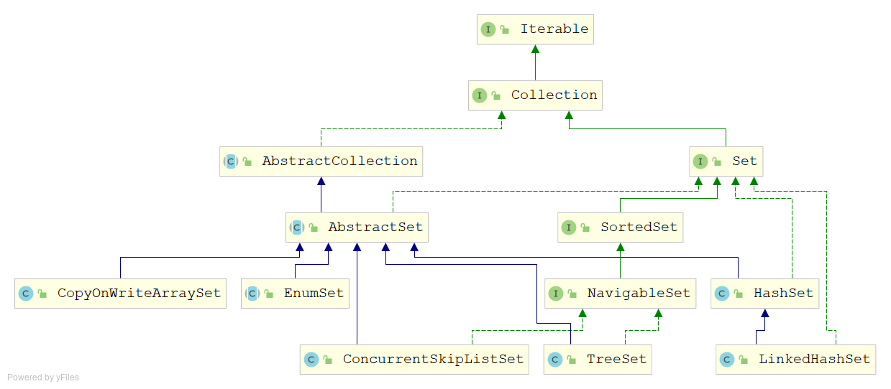
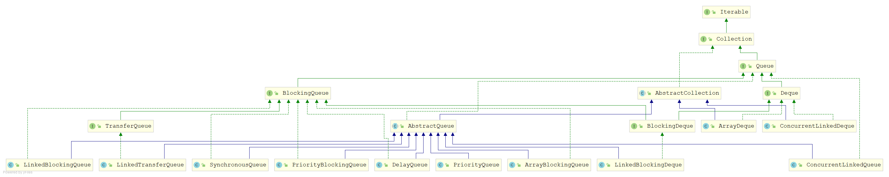
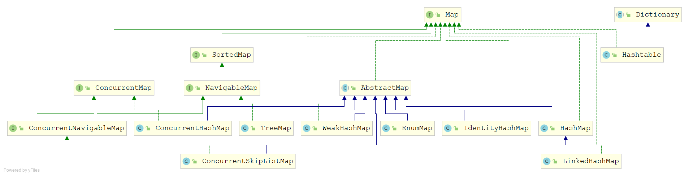

# Java集合类概述

`java.util.Collection`接口是集合类的根接口，代表所有的集合类。它主要有三种类型的实现：List、Set和Queue。Map是java.util包的另外一个接口，它不继承Collection接口，但也是集合体系的一部分。

## List列表

| List实现             | 线程安全       | 优缺点     |
| -------------------- | -------------- | ---------- |
| ArrayList            | 查改快，增删慢 | 线程不安全 |
| LinkedList           | 增删快，查改慢 | 线程不安全 |
| Vector               |                | 线程安全   |
| Stack                |                | 线程安全   |
| CopyOnWriteArrayList |                | 线程安全   |

## Set集合

| Set实现               |      |      |
| --------------------- | ---- | ---- |
| HashSet               |      |      |
| LinkedHashSet         |      |      |
| TreeSet               |      |      |
| CopyOnWriteArraySet   |      |      |
| ConcurrentSkipListSet |      |      |
| EnumSet               |      |      |

## Queue队列

## Map映射

