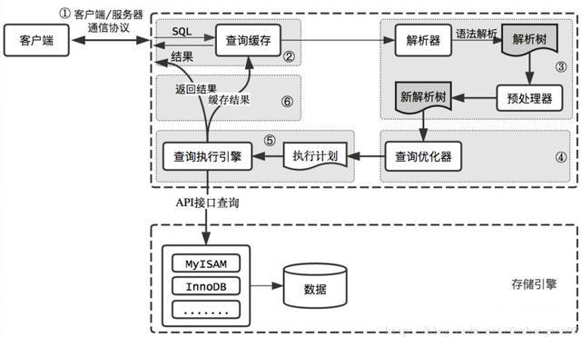

# MySQL查询语句的执行过程

### 执行流程图解

------

### 具体执行步骤

#### 1. 连接器 (Connectors)

首先，客户端（如 Java 应用或 Navicat）通过 TCP/IP 与 MySQL 服务器建立连接。连接器负责：

- **身份验证**：检查用户名和密码。
- **权限获取**：登录成功后，查询出该用户拥有的权限，并在后续执行中进行权限校验。

#### 2. 查询缓存 (Query Cache) — *注意：8.0版本已废弃*

在旧版本中，MySQL 会先看这张表之前有没有执行过完全一样的 SQL。

- 如果**命中**，直接返回结果（非常快）。
- **弊端**：只要表有更新，该表的所有缓存都会失效，命中率极低，因此在 MySQL 8.0 中已被彻底移除。

#### 3. 分析器 (Parser)

如果你没用缓存，MySQL 就需要知道你到底想干什么。

- **词法分析**：识别 SQL 里的字符串分别代表什么。比如 `select` 是查询，`T` 是表名。
- **语法分析**：判断你写的 SQL 是否符合语法规则。如果写错关键词，会收到 `You have an error in your SQL syntax`。

#### 4. 优化器 (Optimizer)

这是最核心的一步。当表中有多个索引，或者关联查询（join）涉及多张表时，优化器会决定：

- 使用哪个索引效率最高。
- 多表关联时，先扫描哪张表。
- **目标**：生成一份执行计划（Execution Plan）。

#### 5. 执行器 (Executor)

开始执行前，执行器会先确认你对这张表有没有**查询权限**。

- 如果有权限，执行器就调用存储引擎的 API 接口。
- **执行逻辑**：比如查询 `ID=10` 的行，执行器会问引擎：“给我第一行，看 ID 是不是 10”，引擎找完给执行器，执行器重复此过程直到扫完所有符合条件的记录。

#### 6. 存储引擎 (Storage Engines)

存储引擎（如 InnoDB, MyISAM）是真正负责数据的提取和写入的。

- 它通过内存缓冲区（Buffer Pool）和磁盘交互，按照执行器的指令读写数据。

------

### 总结：各组件职责表

| **阶段** | **组件** | **主要功能**             |
| -------- | -------- | ------------------------ |
| **连接** | 连接器   | 管理连接、权限校验       |
| **解析** | 分析器   | 词法分析、语法分析       |
| **决策** | 优化器   | 选择索引、生成执行计划   |
| **操作** | 执行器   | 调用引擎接口、处理结果集 |
| **数据** | 存储引擎 | 负责数据的存储和提取     |

参考：

[学习日志：MySql的执行流程](https://blog.csdn.net/weixin_46117680/article/details/140813643)

[一条查询sql的执行流程和底层原理](https://www.cnblogs.com/jindp/p/10744707.html)

[一条SQL语句在MySQL中执行过程全解析](https://blog.csdn.net/weter_drop/article/details/93386581)
