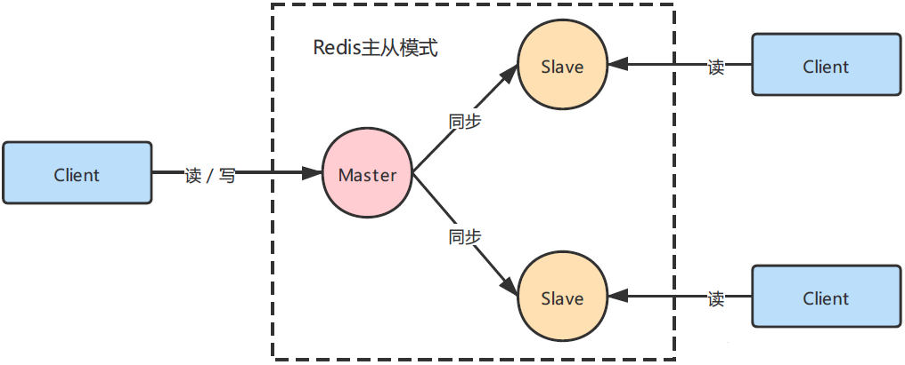
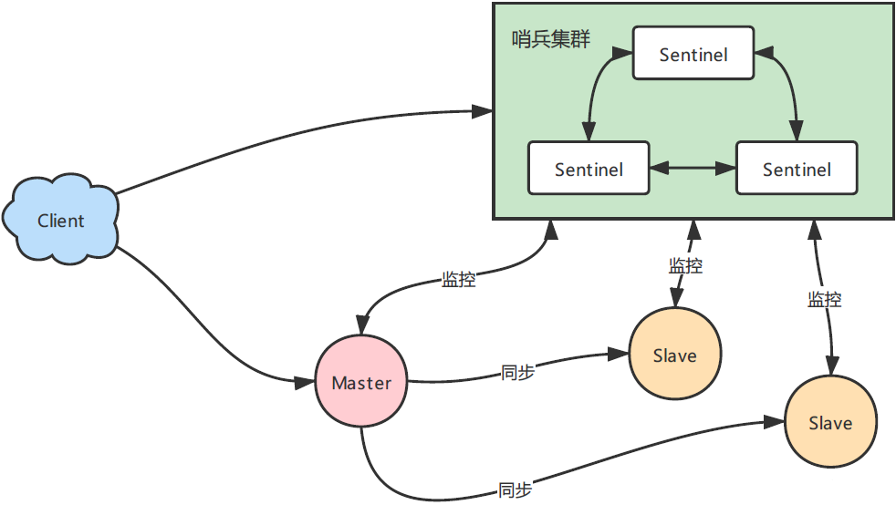
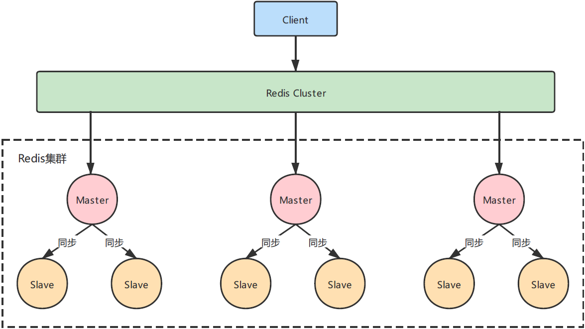

# Redis的部署方式

Redis有四种部署模式，分别是**单机部署**、**主从复制**、**哨兵模式**和**集群模式**。

## 单点部署

优点

1. 配置简单，操作简单

缺点

1. 单点的宕机引来的服务的灾难、数据丢失
2. 单点服务器内存瓶颈，无法无限纵向扩容

## 主从复制 Replication

通过持久化功能，Redis保证了即使在服务器重启的情况下也不会丢失（或少量丢失）数据，因为持久化会把内存中数据保存到硬盘上，重启会从硬盘上加载数据。但是由于数据是存储在一台服务器上的，如果这台服务器出现硬盘故障等问题，也会导致数据丢失。

为了`避免单点故障`，通常的做法是将数据库复制多个副本以部署在不同的服务器上，这样即使有一台服务器出现故障，其他服务器依然可以继续提供服务。

为此， Redis 提供了复制（replication）功能，可以实现当一台数据库中的数据更新后，自动将更新的数据同步到其他数据库上。

在复制的概念中，数据库分为两类，一类是主数据库（`master`），另一类是从数据库(`slave`）。主数据库可以进行读写操作，当写操作导致数据变化时会自动将数据同步给从数据库。而从数据库一般是只读的，并接受主数据库同步过来的数据。一个主数据库可以拥有多个从数据库，而一个从数据库只能拥有一个主数据库。默认每台Redis服务器都是主节点，从节点需要在配置文件中单独配置，才会从默认的主节点变成从节点。一个主节点可以有0个或多个从节点。

### 实现原理

总体概况就是：当主从服务器刚建立连接的时候，进行全量同步；全量复制结束后，进行增量复制。当然，如果有需要，slave 在任何时候都可以发起全量同步。Redis 策略是，无论如何，首先会尝试进行增量同步，如不成功，要求从机进行全量同步。

#### 全量复制

1. slave给master发一个sync同步命令
2. master通过bgsave命令fork子进程，持久化生成RDB文件
3. master通过网络将RDB文件传给slave
4. slave清空老数据，载入新的RDB文件，此时slave阻塞，无法响应客户端，专心复制

#### 增量复制

1. 主从节点各自维护自己的复制偏移量offset，主节点写入命令时，offset=offset+命令字节长度；从节点收到主节点命令也会相应增加自己的offset，并同步给主节点。主节点同时维护自己的offset和从节点的offset，以此来判断主从节点数据是否一致。
2. 主节点指令记录在本地buffer（缓冲区），异步将buffer同步给从节点
3. 若网络不好，同步速度慢了，buffer满了就会从头开始覆盖前面的内容，于是无法增量复制，必须全量复制

> 建议最低配：一主二从，当主节点宕机后，其中一个从节点升级为主节点，还能剩一个从节点。

### 优点

- 支持主从复制，主机会自动将数据同步到从机，可以进行`读写分离`
- Slave 同样可以接受其它 Slaves 的连接和同步请求，这样可以有效的分载 Master 的同步压力
- Master Server 是以非阻塞的方式为 Slaves 提供服务。所以在 Master-Slave 同步期间，客户端仍然可以提交查询或修改请求
- Slave Server 同样是以非阻塞的方式完成数据同步。在同步期间，如果有客户端提交查询请求，Redis则返回同步之前的数据

### 缺点

- Redis不具备自动容错和恢复功能，主机从机的宕机都会导致前端部分读写请求失败，需要等待机器重启或者手动切换前端的IP才能恢复（**也就是要人工介入**）；
- 主机宕机，宕机前有部分数据未能及时同步到从机，切换IP后还会引入数据不一致的问题，降低了系统的可用性；
- 如果多个 Slave 断线了，需要重启的时候，尽量不要在同一时间段进行重启。因为只要 Slave 启动，就会发送sync 请求和主机全量同步，当多个 Slave 重启的时候，可能会导致 Master IO 剧增从而宕机。
- Redis 较难支持在线扩容，在集群容量达到上限时在线扩容会变得很复杂；

## 哨兵模式  Sentinel

在主从复制架构中，redis不具备容错和自动恢复功能，如果master节点宕机，从节点无法自动升级为主节点。哨兵模式的出现用于解决主从模式中无法自动升级主节点的问题，一个哨兵是一个节点，用于监控主从节点的健康，当主节点挂掉的时候，自动选择一个最优从节点升级为主节点。

哨兵模式是一种特殊的模式，首先Redis提供了哨兵的命令，哨兵是一个独立的进程，作为进程，它独立运行。其原理是哨兵通过发送命令，等待Redis服务器响应，从而监控运行的多个Redis实例。

但哨兵如果挂了怎么办？于是哨兵一般都会是一个集群，是集群高可用的心脏，一般由3-5个节点组成，即使个别节点挂了，集群还可以正常运行。

哨兵模式的主要作用就是`支持动态的故障切换操作`，不需要人工接入。

### 实现原理

通过发送命令，让 Redis 服务器返回监控其运行状态，包括主服务器和从服务器。当哨兵监测到 master 宕机，会自动将 slave 切换成 master ，然后通过`发布订阅模式`通知其他的从服务器，修改配置文件，让它们切换主机。

#### 主观下线

当Sentinel节点ping其他节点，超时未回复，Sentinel节点就会对该节点做失败判定。主观下线是当前Sentinel节点的一家之言，存在误判可能

#### 客观下线

当Sentinel主观下线的节点是master，该Sentinel会询问其他Sentinel对master的判断，当大部分Sentinel都对master的下线做了同意判断，那么这个判断就是比较客观的

### 优点

- 哨兵模式是基于主从模式的，所有主从的优点，哨兵模式都具有。
- 可以自动切换主从节点，系统更健壮，可用性更高(**可以看作自动版的主从复制**)。

### 缺点

- Redis较难支持在线扩容，在集群容量达到上限时在线扩容会变得很复杂。
- 相当挂了一套旁路系统，增加了对于哨兵集群的运维成本。

## 集群部署  Cluster

集群方案真正实现了Redis高可用，有很多种实现方式，目前最常用的Redis Cluster是Redis的亲儿子，是Redis作者自己提供的Redis集群化方案，从Redis 3.0版本开始正式提供。

集群由多个Redis主从组成，每一个主从代表一个节点，每个节点负责一部分数据，他们之间通过一种特殊的二进制协议交互集群信息。

Redis Cluster将所有数据分片，分成16384个槽位，Redis Cluster对key值使用crc16算法进行hash，然后用除留余数发模除16384得到具体的槽位，每个节点负责其中一部分槽位。

当客户端连接集群，会得到一份集群的槽位匹配信息，当客户端要查找key，可以直接定位到目标节点。

Cluster去中心化，由多个节点组成，客户端连接时可以只用一个节点的地址，其余节点可通过该节点自动发现，但如果该节点挂了，就必须手动更换地址，因此连接多个地址安全性更高。

参考：

[Redis三种部署模式](https://mp.weixin.qq.com/s/uFhHbuTnwRE-t0bYeAt_yw)

[Redis四种部署模式（原理、优缺点及解决方案）](https://blog.csdn.net/qq_26012495/article/details/120299332)
