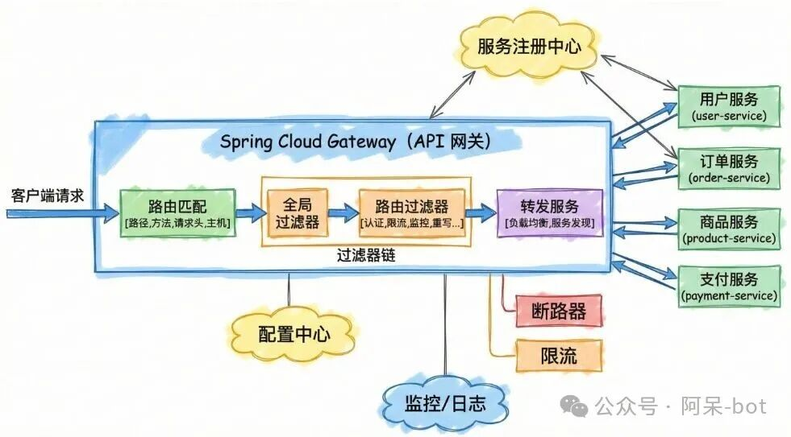

# SpringCloudGateway

## 路由

Gateway 的路由可以分为三种：

1. **静态路由**：静态路由是指在配置文件中预先定义好的路由规则，它们在应用启动时就已经存在。静态路由的优点是可以快速定位和处理请求，缺点是需要手动配置，不支持动态添加、修改和删除路由规则。
2. **动态路由**：动态路由是指在运行时动态添加、修改和删除路由规则，可以根据不同的条件动态地调整路由规则，例如根据请求路径、请求头、请求参数等条件。动态路由的优点是可以根据实际情况调整路由规则，缺点是需要额外的管理和维护成本。
3. **自动路由**：自动路由是指根据服务注册中心的服务信息自动生成路由规则。当有新的服务上线或下线时，路由规则也会自动更新。自动路由的优点是可以根据实际情况自动调整路由规则，缺点是需要服务注册中心的支持。其实服务发现可以支持很多种，主要实现spring cloud 提供的接口即可。

## 断言

## 过滤器

在 Spring Cloud Gateway 中，过滤器分为 GlobalFilter 和 GatewayFilter 两种，二者区别如下：

- GlobalFilter : 全局过滤器，不需要在配置文件中配置，系统初始化时加载，作用在所有的路由规则上。
- GatewayFilter : 局部过滤器，需要通过`spring.cloud.routes.filters`参数配置在具体路由上，只作用在配置的路由规则上。
