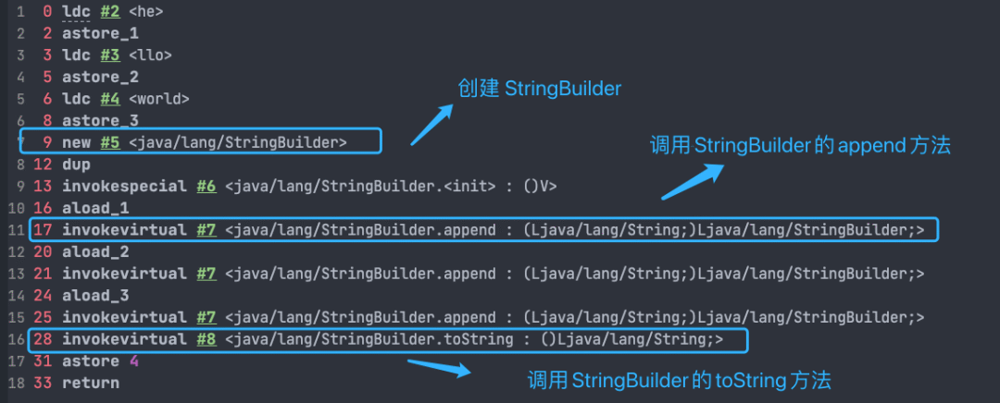

# Java中的String类

`String` 是 Java 语言非常基础和重要的类，提供了构造和管理字符串的各种基本逻辑。它是典型的 `Immutable` 类，被声明成为 `final class`，所有属性也都是 `final` 的。

也由于它的不可变性，类似拼接、裁剪字符串等动作，都会产生新的 `String` 对象。

## 为什么String是不可变的？

`String` 真正不可变有下面几点原因：

1. 保存字符串的数组被 `final` 修饰且为私有的，并且`String` 类没有提供/暴露修改这个字符串的方法。
2. `String` 类被 `final` 修饰导致其不能被继承，进而避免了子类破坏 `String` 不可变。

## String的运算符重载

Java 语言本身并不支持运算符重载，“+”和“+=”是专门为 String 类重载过的运算符，也是 Java 中仅有的两个重载过的元素符。

```java
String str1 = "he";
String str2 = "llo";
String str3 = "world";
String str4 = str1 + str2 + str3;
```

上面的代码对应的字节码如下：



可以看出，字符串对象通过“+”的字符串拼接方式，实际上是通过 `StringBuilder` 调用 `append()` 方法实现的，拼接完成之后调用 `toString()` 得到一个 `String` 对象 。

不过，在循环内使用“+”进行字符串的拼接的话，存在比较明显的缺陷：**编译器不会创建单个 `StringBuilder` 以复用，会导致创建过多的 `StringBuilder` 对象**。

```java
String[] arr = {"he", "llo", "world"};
String s = "";
for (int i = 0; i < arr.length; i++) {
    s += arr[i];
}
System.out.println(s);
```

`StringBuilder` 对象是在循环内部被创建的，这意味着每循环一次就会创建一个 `StringBuilder` 对象。

如果直接使用 `StringBuilder` 对象进行字符串拼接的话，就不会存在这个问题了。

```java
String[] arr = {"he", "llo", "world"};
StringBuilder s = new StringBuilder();
for (String value : arr) {
    s.append(value);
}
System.out.println(s);
```

参考：[Java 基础常见知识点&面试题总结(中)，2022 最新版！](https://mp.weixin.qq.com/s/PQA_sB5J2nK05ilKUDz0mQ)

## StringBuilder

`StringBuilder` 是 Java 1.5 中新增的，在能力上和 `StringBuffer` 没有本质区别，但是它去掉了线程安全的部分，有效减小了开销，是绝大部分情况下进行字符串拼接的首选。

## StringBuffer

`StringBuffer` 是为解决上面提到拼接产生太多中间对象的问题而提供的一个类，我们可以用 `append` 或者 `add` 方法，把字符串添加到已有序列的末尾或者指定位置。

`StringBuffer` 本质是一个线程安全的可修改字符序列，它保证了线程安全，也随之带来了额外的性能开销，所以除非有线程安全的需要，不然还是推荐使用它的后继者，也就是 `StringBuilder`。
