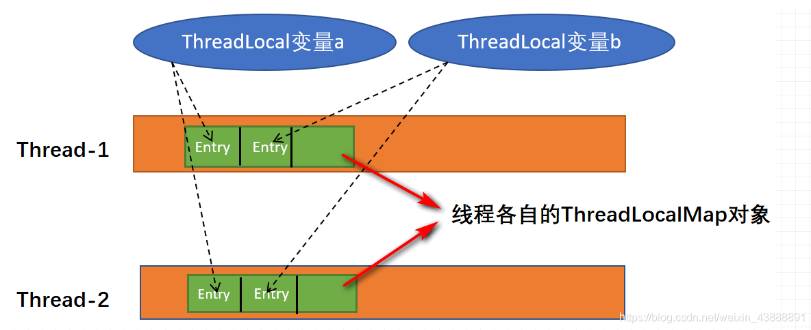

# ThreadLocal的原理与实现

## 简介

ThreadLocal叫做**线程变量**，ThreadLocal是用来存放数据的，而且存放的数据在每个线程单独维护一份。多个线程操作这个变量的时候，实际是在操作自己本地内存里面的变量，从而起到**线程隔离**的作用，避免了并发场景下的线程安全问题。

> **为什么要用ThreadLocal**
>
> 并发场景下，会存在多个线程同时修改一个共享变量的场景。这就可能会出现**线性安全**问题。
>
> 为了解决线性安全问题，可以用加锁的方式，比如使用`synchronized` 或者`Lock`。但是加锁的方式，可能会导致系统变慢。
>
> 还有另外一种方案，就是使用空间换时间的方式，即使用`ThreadLocal`。使用`ThreadLocal`类访问共享变量时，会在每个线程的本地，都保存一份共享变量的拷贝副本。多线程对共享变量修改时，实际上操作的是这个变量副本，从而保证线性安全。

## 基本使用

ThreadLocal对象提供3个公有方法 ：set()、get()和remove()。基本的操作就是set设值，get取值。就是一个存取数据的用法。

```java
ThreadLocal<Object> threadLocal1 = new ThreadLocal<>();
ThreadLocal<Object> threadLocal2 = new ThreadLocal<>();
for (int i = 0; i < 3; i++) {
    new Thread(() -> {
        threadLocal1.set(Thread.currentThread().getId() + "-1");
        threadLocal2.set(Thread.currentThread().getId() + "-2");

        System.out.println(threadLocal1.get());
        System.out.println(threadLocal2.get());
        threadLocal1.remove();
        threadLocal2.remove();
    }).start();
}
```

## 实现原理

在ThreadLocal的set方法中，先是取出当前线程，再取出当前线程的ThreadLocalMap对象（如果没有则创建），取到ThreadLocalMap后将值设置到其中去。

```java
public void set(T value) {
    Thread t = Thread.currentThread();
    ThreadLocalMap map = getMap(t);
    if (map != null)
        map.set(this, value);
    else
        createMap(t, value);
}

ThreadLocalMap getMap(Thread t) {
    return t.threadLocals;
}
```

这里涉及三个类ThreadLocal、Thread和ThreadLocalMap，其中ThreadLocalMap是定义在ThreadLocal里的静态内部类，在Thread中有个成员对象是ThreadLocalMap类型的，用于存放当前线程的变量。三者关系如下图：



### set方法

ThreadLocal的set方法实际操作的是ThreadLocalMap的set方法。每个Thread都有一个ThreadLocalMap对象，每个ThreadLocalMap中都有一个Entry数组，Entry中的元素存放着不同ThreadLocal实例在当前线程中的value数据。

```java
public class Thread implements Runnable { 
    //当前线程的ThreadLocalMap
    ThreadLocal.ThreadLocalMap threadLocals = null;
}

static class ThreadLocalMap {
    //实际存放数据的对象，包含key和value
    private Entry[] table;
}
```

在ThreadLocalMap存入数据时候，使用ThreadLocal作为key，根据ThreadLocal实例计算hash值得到数组下标，存入到Entry数组中。

### hash冲突

开放寻址法

### 探测式清理

### 启发式清理

### 扩容机制

## 注意事项

### 内存泄露问题

在 ThreadLocalMap 中的 Entry 的 key 是对 ThreadLocal 的 `WeakReference` 弱引用，而 value 是强引用。当 ThreadLocalMap 的某 ThreadLocal 对象只被弱引用，GC 发生时该对象会被清理，此时 key 为 null，但 value 为强引用不会被清理。此时 value 将访问不到也不被清理掉就可能会导致内存泄漏。

因此我们使用完 ThreadLocal 后最好手动调用 `remove()` 方法。但其实在 ThreadLocalMap 的实现中以及考虑到这种情况，因此在调用 `set()`、`get()`、`remove()` 方法时，会清理 key 为 null 的记录。

### ThreadLocal 无法给子线程共享父线程的线程副本数据

