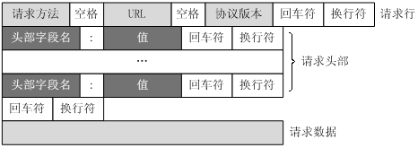

# HTTP协议

## 简介

## 工作原理

### 端口

默认端口为80，可以修改为其他端口

### 三大特性

- 无连接
- 无状态
- 媒体独立

## 请求格式

## 响应格式

### 状态码

|      | 类别                             | 原因短语                   |
| ---- | -------------------------------- | -------------------------- |
| 1xx  | Informational(信息性状态码)      | 接收的请求正在处理         |
| 2xx  | Success（成功状态码）            | 请求正常处理完毕           |
| 3xx  | Redirection（重定向状态码）      | 需要进行附加操作以完成请求 |
| 4xx  | Client Error（客户端错误状态码） | 服务器无法处理请求         |
| 5xx  | Server Error（服务器错误状态码） | 服务器处理请求出错         |

参考：

[HTTP 教程 | 菜鸟教程](https://www.runoob.com/http/http-tutorial.html)

[HTTP 1.0 / 1.1 / 2.0 / 3.0 区别](https://blog.csdn.net/m0_52963553/article/details/129894192)

[HTTPS相关知识点](https://blog.csdn.net/m0_52963553/article/details/130026369)
