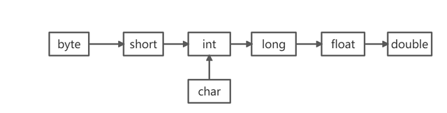

# Java的基本数据类型

## 基本数据类型

Java 中有 8 种基本数据类型，分别为：

- 6 种数字类型：

- - 4 种整数型：`byte`、`short`、`int`、`long`
  - 2 种浮点型：`float`、`double`

- 1 种字符类型：`char`

- 1 种布尔型：`boolean`。

这 8 种基本数据类型的默认值以及所占空间的大小如下：

| 基本类型  | 位数 | 字节 | 默认值  |                  取值范围                  |
| :-------- | :--- | :--- | :------ | :----------------------------------------: |
| `byte`    | 8    | 1    | 0       |                 -128 ~ 127                 |
| `short`   | 16   | 2    | 0       |               -32768 ~ 32767               |
| `int`     | 32   | 4    | 0       |          -2147483648 ~ 2147483647          |
| `long`    | 64   | 8    | 0L      | -9223372036854775808 ~ 9223372036854775807 |
| `char`    | 16   | 2    | 'u0000' |                 0 ~ 65535                  |
| `float`   | 32   | 4    | 0f      |           1.4E-45 ~ 3.4028235E38           |
| `double`  | 64   | 8    | 0d      |     4.9E-324 ~ 1.7976931348623157E308      |
| `boolean` | 1    |      | false   |                true、false                 |

这八种基本类型都有对应的包装类分别为：`Byte`、`Short`、`Integer`、`Long`、`Float`、`Double`、`Character`、`Boolean` 。

## 小数缓存

Java 基本数据类型的包装类型的大部分都用到了缓存机制来提升性能。

`Byte`,`Short`,`Integer`,`Long` 这 4 种包装类默认创建了数值 **[-128，127]** 的相应类型的缓存数据，`Character` 创建了数值在 **[0,127]** 范围的缓存数据，`Boolean` 直接返回 `True` or `False`。

两种浮点数类型的包装类 `Float`,`Double` 并没有实现缓存机制。

**Integer 缓存源码：**

```java
public static Integer valueOf(int i) {
    if (i >= IntegerCache.low && i <= IntegerCache.high)
        return IntegerCache.cache[i + (-IntegerCache.low)];
    return new Integer(i);
}

private static class IntegerCache {
    static final int low = -128;
    static final int high;
    static {
        // high value may be configured by property
        int h = 127;
    }
}
```

```java
Integer a = 127;
Integer b = 127;
System.out.println(a == b);//true
// 自动装箱，等价于Integer.valueOf(127);

Integer c = 128;
Integer d = 128;
System.out.println(c == d);//false
// 自动装箱，等价于Integer.valueOf(128);

Integer i1 = 40;
Integer i2 = new Integer(40);
System.out.println(i1==i2);//false
//new Integer(40)创建了新的对象，而Integer i1 = 40等价于Integer.valueOf(40)使用小数缓存

int e = 128;
int f = 128;
System.out.println(e == f);//true
//基本类型没有缓存机制，直接是常量
```

注意：所有整型包装类对象之间值的比较，应当使用 equals 方法比较。

**== 和 equals 的区别：**

== 比较的是对象的内存地址，值相同时结果不一定为true；

equals 是内容比较，值相同时结果一定为true，反之亦然。

## 自动装箱和拆箱

Java中每一种基本数据类型都对应着一种包装类型，装箱是指Java能够自动将基本数据类型转化成包装类型，拆箱是指自动将包装类型转化为基本数据类型。

```java
Integer i = 10;  //装箱
int j = i;       //拆箱
```

装箱是自动调用了`Integer.valueOf(int i)`方法，拆箱则是调用了`Integer.intValue(Integer i)`方法。

## 类型转换

对于基础类型的转换有两种方式。 一种由小到大的转换， 不会丢失精度。另一种由大变小的强制转换， 有可能有丢失精度和出错。

### 自动转换

> 从小转到大的范围情况下可以自动转换， 也可以叫作隐式转换，按照数据类型的从小到大自动进行转换。



```java
int intVal = 100;
long longVal = intVal;// 隐式转换
```

### 强制转换

> 强制转换又叫显示转换， 代表着数据类型的转换默认无法进行转换， 所以需要显式的进行类型转换。 强制类型转换的格式为在变量的名字前面加上括号写上基础类型。

```java
long longVal = 100L;
int intVal = (int) longVal;
```

占用字节大的数据类型转换字节小的就需要强制转换。 并且转换的时候需要注意丢失精度的问题。

参考:[在Java中如何进行数据类型的转换](https://baijiahao.baidu.com/s?id=1716094381259291933)
