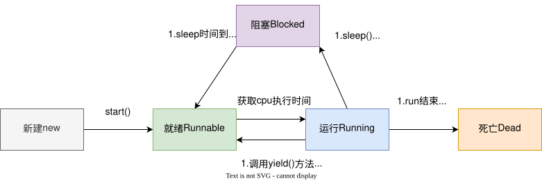

# 线程

## 线程的创建方式

1. 继承Thread类
2. 实现Runnable接口
3. 实现Callable接口
4. 线程池方式

## 线程的状态

## 线程的方法

### Thread.sleep(long)

使线程转到**超时等待阻塞（TIMED_WAITING）** 状态。long参数设定睡眠的时间，以毫秒为单位。当睡眠结束后，线程自动转为就绪（Runnable）状态。sleep不会释放锁

### thread.interrupt()

中断线程；有两种情况：

1.如果线程正在执行，则通过设置一个标志来表示线程已经被中断，线程内可通过interrupted()或isInterrupted()来判断线程是否终止，然后主动停止，优雅终止线程。两个方法的区别是interrupted()会重置标志位，isInterrupted()不会。

### join

### Thread.yield()

让出当前线程的cpu执行权，使其他具有相同优先级（或者高于）的线程有机会获得cpu执行权。

### object.wait()/object.notify()

这几个方法是在Object上定义的，因为在Java中所有对象都可以是锁。wait()和notify()必须使用在synchronized同步代码块内，wait()表示阻塞等待，notify()表示唤醒其他wait中的线程。

