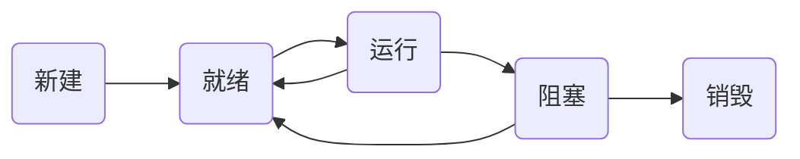

# 面试题

## HTTP

### GET请求和POST请求有什么区别？

### 什么是RESTful？

## Java基础

### ArrayList和LinkedList有什么区别？

1）ArrayList基于对象数组实现，支持随机访问，优点是查询快，缺点是增删慢

2）LinkedList基于链表结构实现，查询速度慢，增删快

### ArrayList如何删除中间的元素？

### HashMap, ConcurrentHashMap实现原理

### String中的常用方法有哪些？

length()、isEmpty()、split()、toLowerCase()、toUpperCase() 、subString()、trim()、concat(“abc”)、contains(“a”)

### String、StringBuffer与StringBuilder的区别？

### fail-fast与fail-safe有什么区别？

Iterator的fail-fast属性与当前的集合共同起作用，因此它不会受到集合中任何改动的影响。
Java.util包中的所有集合类都被设计为fail-fast的，
而java.util.concurrent中的集合类都为fail-safe的。
Fall—fast迭代器抛出ConcurrentModificationException，
fall—safe迭代器从不抛出ConcurrentModificationException。

### 重载和重写的区别？

1）重载指的是一个类中可以存在多个方法名相同，参数列表不同的方法。

2）重写指的是子类可以重新实现父类的方法，要求方法名、方法参数和返回值都要相同。

### Java中常见的异常

1) `java.lang.NullPointerException` 空指针异常

2) `java.lang.ClassNotFoundException`指定的类不存在异常

3) `java.lang.ArrayIndexOutOfBoundsException` 数组下标越界

4) `java.sql.SQLException` SQL异常

## 多线程与高并发

### 线程生命周期

线程的生命周期包含5个阶段，包括：`新建`、`就绪`、`运行`、`阻塞`、`销毁`。

### 什么是死锁？如何解决死锁问题？

线程死锁是指由于两个或者多个线程互相持有对方所需要的资源，导致这些线程处于等待状态，无法前往执行。当线程进入对象的synchronized代码块时，便占有了资源，直到它退出该代码块或者调用wait方法，才释放资源，在此期间，其他线程将不能进入该代码块。当线程互相持有对方所需要的资源时，会互相等待对方释放资源，如果线程都不主动释放所占有的资源，将产生死锁。若无外力作用，它们都将无法推进下去。

产生死锁必须满足以下**4个条件**：

- **互斥条件**：一个资源每次只能被一个进程使用。
- **请求与保持条件**：一个进程因请求资源而阻塞时，对已获得的资源保持不放。
- **不剥夺条件**：进程已获得的资源，在末使用完之前，不能强行剥夺。
- **循环等待条件**：若干进程之间形成一种头尾相接的循环等待资源关系。

避免死锁最简单的方法就是`阻止循环等待条件`，将系统中所有的资源设置标志位、排序，规定所有的进程申请资源必须以一定的顺序（升序或降序）做操作来避免死锁。

### Java多线程中调用wait() 和 sleep()方法有什么区别？

Java程序中wait 和 sleep都会造成某种形式的暂停，它们可以满足不同的需要。wait()方法用于线程间通信，如果等待条件为真且其它线程被唤醒时它会释放锁，而 sleep()方法仅仅释放CPU资源或者让当前线程停止执行一段时间，但不会释放锁。

相同点：都会造成线程某种形式的暂停

不同点：wait()释放锁，sleep()不会释放锁

### 什么是CAS？

CAS(Compare and Swap)，比较与交换，实现并发算法时常用到的一种技术，是Java保证原子性的一种重要方法，也是一种`乐观锁`的实现方式。CAS有3个参数，内存值V，旧的预期值A，要修改的新值B。当且仅当预期值A和内存值V相同时，将内存值V修改为B，否则什么都不做。

缺点：CAS存在一个很明显的问题，即ABA问题。

问题：如果变量V初次读取的时候是A，并且在准备赋值的时候检查到它仍然是A，那能说明它的值没有被其他线程修改过了吗？

如果在这段期间曾经被改成B，然后又改回A，那CAS操作就会误认为它从来没有被修改过。针对这种情况，java并发包中提供了一个带有标记的原子引用类`AtomicStampedReference`，它可以通过控制变量值的版本来保证CAS的正确性。

### Java中堆和栈有什么不同？

栈是一块和线程紧密相关的内存区域。每个线程都有自己的栈内存，用于存储本地变量，方法参数和栈调用，一个线程中存储的变量对其它线程是不可见的。

堆是所有线程共享的一片公用内存区域。对象都在堆里创建，为了提升效率线程会从堆中弄一个缓存到自己的栈，如果多个线程使用该变量就可能引发问题，这时volatile 变量就可以发挥作用了，它要求线程从主存中读取变量的值。

## MySQL

## Redis

### Redis有几种数据类型？

Redis有五种数据类型，分别是：`string`、`hash`、`list`、`set`和`zset`

| 类型           | 结构                                              | 使用场景                                                     |
| -------------- | ------------------------------------------------- | ------------------------------------------------------------ |
| 字符串(string) | 可存储`文本`、数字或二进制数据                    | 字符串缓存，计数器（自增自减），分布式锁，二进制文件（序列化对象或图片） |
| 哈希(hash)     | 键值对的集合，适合存储对象（如用户信息）          | 对象缓存，部分更新，聚合数据                                 |
| 列表(list)     | 双向链表，支持在头部或尾部快速插入/删除元素       | 消息队列                                                     |
| 集合(set)      | 无序且元素`唯一`的集合，支持交/并/差集运算        | 标签系统，好友关系，抽奖去重                                 |
| 有序集合(zset) | 元素唯一且按关联的分数（Score）排序，支持范围查询 | 排行榜，优先级队列，延迟队列                                 |

### 为什么Redis是单线程还这么快？

1）纯内存操作

2）单线程操作，避免上下文切换

3）采用了非阻塞I/O多路复用机制

### 缓存穿透、缓存击穿和缓存雪崩是什么，怎么解决？

1）**缓存穿透**：大量请求缓存中不存在的数据（如黑客恶意访问不存在的key），导致查询缓存不命中，然后穿透数据查询依然不存在。这时会有大量请求穿透缓存去访问数据库。

解决方案：

①BloomFilter：用一个足够大的bit map （布隆过滤器），将所有可能性的key都存储在其中，如果出现一定不存在的key，拦截掉该不可能存在的请求，不让其访问数据库，从而避免了对底层存储系统的查询压力。

②缓存空值：如果出现访问数据库中不存在的key，数据库返回一个null值，然后我们把这个空结果存储在redis缓存中，并设置其过期时间极短，后面再出现查询这个key的请求的时候，直接返回null。

2）**缓存击穿**：一个非常热点的Key，当他失效的瞬间，持续的大并发访问穿透缓存，直接请求数据库。

解决方案

①设置数据永远不过期

②加上互斥锁

3）**缓存雪崩**：大面积缓存数据集中过期失效，造成大量请求直接访问数据库，导致数据库连接不够用或者数据库处理不来，从而导致系统不可用。

解决方案：

①使用快速失败的熔断策略，减少数据库的访问压力。

②使用主从模式和集群模式保证缓存服务器的高可用。

### Redis的过期策略和内存淘汰机制

Redis采用`定期删除`+`惰性删除`的过期策略。

①定期删除：默认100ms去*随机抽取*设置了过期时间的数据，如已过期则删除。

②惰性删除：当redis去获取一个数据的时候，检查是否已经过期，如过期则删除。

### 如何解决Redis双写一致性问题？

双写一致性问题可分为`最终一致性`和`强一致性`，如果对数据有强一致性要求，则不能放缓存。

保证最终一致性的做法是：先更新数据库，再删除缓存。

存在删除缓存失败的情况，需要提供补偿机制，比如消息队列。

### Redis怎么实现分布式锁？

## 消息队列

### 为什么要使用消息队列

优点：解耦、异步、削峰

缺点：系统可用性降低、系统复杂度提高、一致性问题

### 如何保证消息不丢失

- **生产者端**：同步发送 + ACK 确认机制（如 Kafka 的 `acks=all`）
- **Broker 端**：持久化存储（如 Kafka 的副本机制、RocketMQ 的同步刷盘）
- **消费者端**：手动提交 Offset（避免自动提交导致消息丢失）

### 如何防止消息重复消费

- 原因：网络重发、消费者重启等导致重复提交 Offset
- 解决方案：
  - 业务层幂等（唯一键 + 状态机，如订单 ID）
  - 数据库去重（如插入前检查唯一索引）
  - 中间件支持（如 RocketMQ 的幂等消息）

### 怎么实现消息顺序消费

- Kafka：同一 Partition 内的消息有序，需确保生产者和消费者单线程操作同一 Partition。
- RocketMQ：通过 Hash 算法将同一业务 ID 的消息发送到同一队列（Queue）。
- 全局顺序：牺牲吞吐量，单分区/队列 + 单消费者。

### 怎么实现延迟队列

- RocketMQ：内置延迟级别（18 种）
- RabbitMQ：通过死信队列（DLX）和 TTL 实现
- Kafka：需要外部存储（如时间轮）或自定义延时队列

### 设计一个消息队列系统，需要考虑哪些方面？

- 高可用（集群、副本）
- 可靠性（不丢失、不重复）
- 扩展性（分区/分片）
- 监控（延迟、堆积）
- 运维（平滑升级）等

## Tomcat

### Tomcat如何实现运用间隔离？

## Mybatis

### 介绍一下Mybatis的二级缓存

### Mybatis插件实现原理

## Dubbo

### 注册中心挂了，dubbo还能继续通讯吗

可以继续通讯。Dubbo会缓存一份注册表到本地。注册中心全部宕机后，服务提供者和服务消费者仍能通过本地缓存通讯，但是不能新增和修改服务了。

## Spring

### Bean的生命周期

实例化 → 属性填充 → Aware 接口回调（如 `BeanNameAware`）→ 初始化前（`@PostConstruct`）→ 初始化（`InitializingBean`）→ 初始化后（AOP 代理）→ 使用 → 销毁（`@PreDestroy`）

### @Autowired 和 @Resource有什么区别

`@Autowired` 默认按类型注入，`@Resource` 默认按名称注入

### 什么是循环依赖？Spring 如何解决循环依赖？

简单来说就是通过`三级缓存`提前暴露未初始化的Bean实例来解决循环依赖。

依赖注入方式有：1、字段注入 2、 Setter 注入 3、构造器注入

Bean的作用域范围有：1、单例（Singleton） 2、原型（Prototype）

Spring无法解决原型作用域或构造器注入的循环依赖

1. **创建 Bean A**：
   - Spring 实例化 Bean A（调用构造器），此时 A 对象是“半成品”（未填充属性）。
   - 将 A 的早期引用（未初始化的对象）存入 **三级缓存（SingletonFactories）**。
2. **填充 Bean A 的属性**：
   - Spring 发现 Bean A 依赖 Bean B，尝试从容器中获取 B。
3. **创建 Bean B**：
   - Spring 实例化 Bean B（调用构造器），此时 B 对象是“半成品”。
   - 将 B 的早期引用存入三级缓存。
4. **填充 Bean B 的属性**：
   - Spring 发现 Bean B 依赖 Bean A，尝试从容器中获取 A。
   - **从三级缓存中获取 A 的早期引用**，注入到 B 中，完成 B 的初始化。
   - 将初始化后的 Bean B 放入 **一级缓存（SingletonObjects）**。
5. **完成 Bean A 的初始化**：
   - Bean B 创建完成后，将 B 注入到 A 中，完成 A 的初始化。
   - 将初始化后的 Bean A 放入一级缓存。

### AOP 解决了什么问题？举例应用场景。

解耦横切关注点（如日志、事务、权限），避免代码重复。

### AOP 的核心概念

切面（Aspect）、连接点（JoinPoint）、通知（Advice）、切点（Pointcut）。

切面 = 切点 + 通知；通知类型：`@Before`、`@After`、`@Around` 等。

### Spring AOP 动态代理有哪些实现方式

JDK 动态代理（接口）或 CGLIB（类）

### JDK 动态代理和 CGLIB 的区别？何时强制使用 CGLIB？

目标类未实现接口时，Spring 会使用 CGLIB。

## Spring Cloud

### Spring Cloud和Dubbo有什么区别

## 其它问题

### 秒杀系统如何实现