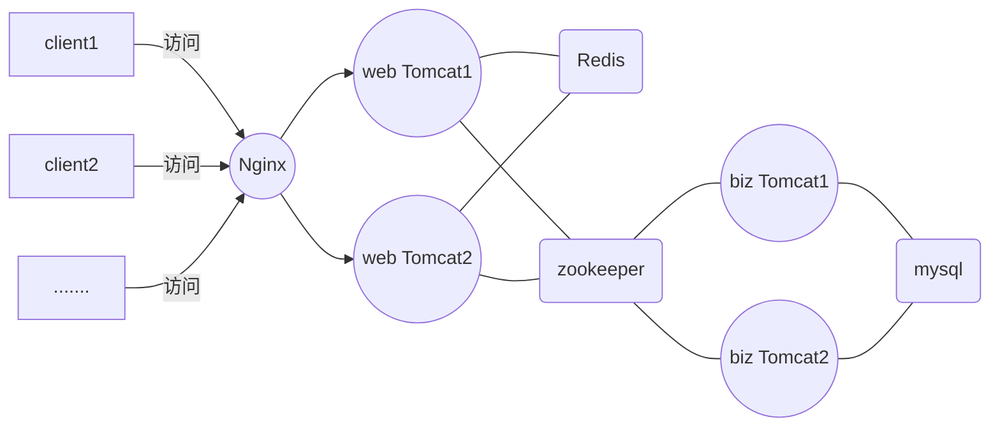

# 搭建基于Docker的分布式运行环境

[TOC]

## 一、前言

​	本文记录搭建Docker分布式运行环境的过程。

​	使用到的技术架构是Nginx作为反向代理，Tomcat作为web容器，zookeeper作为服务注册与发现，mysql作为持久化层，缓存使用Redis。为提高生产效率，使用jenkins和gitlab配合作为持续集成工具。

​	本文提供了一个分布式情况下的session管理解决方案。

​	架构图如下：



## 二、安装Docker

### 2.1  ubuntu下安装docker

- 查看系统版本

  docker需要64位操作系统，并且需要kernel内核至少在3.10以上。kernel3.10版本之前的系统缺少一些特性来运行docker容器。这些旧版本有些已知的bugs会导致数据丢失并且在一定条件下会频繁的故障。

  更新apt包索引

```shell
sudo apt-get update
```

- 安装最新版本的Docker CE

```shell
sudo apt-get install -y docker-ce
```

- 查看docker启动已经启动

```
systemctl status docker
```

- 启动docker

``` shell
sudo systemctl start docker
```

- 运行hello-world镜像

```shell
sudo docker run hello-world
```


## 三、构建自定义Tomcat镜像

​	由于docker hub上面的tomcat镜像不可以设置tomcat user，然后我们有需要设置tomcat帐号来给jenkins访问tomcat，所以需要自制一个tomcat，主要为了设置tomcat user。

### 3.1、创建文件夹

​	在任意你喜欢的目录下新建一个文件夹mytomcat

```shell
mkdir mytomcat
```

### 3.2、下载Tomcat

​	到[Tomcat官网](https://tomcat.apache.org/download-70.cgi)下载Tomcat7，复制conf目录下的`server.xml`和`tomcat-users.xml`文件到mytomcat目录中，复制webapps/ROOT目录下的index.jsp到mytomcat目录

### 3.3、修改配置文件

#### 3.3.1、修改server.xml文件

​	在Connector port=8080的节点新增一个属性URIEncoding="UTF-8"，如下已经添加好了，这样可以支持中文访问Tomcat。

```xml
  <Connector port="8080" protocol="HTTP/1.1"
               connectionTimeout="20000"
               redirectPort="8443" URIEncoding="UTF-8" />
```

#### 3.3.2、修改tomcat-users.xml文件

​	修改后文件：

```xml
<?xml version='1.0' encoding='utf-8'?>
<tomcat-users>
	<role rolename="manager-gui"/>
	<role rolename="manager-script"/>
	<role rolename="manager-jmx"/>
	<role rolename="manager-status"/>
	<user username="tomcat" password="tomcat" roles="manager-gui,manager-script,manager-jmx,manager-status" />
</tomcat-users>
```

#### 3.3.3、修改index.jsp文件

​	因为制作成镜像之后会启动多个容器示例，这里修改index.jsp是为了设置一个环境变量来区分出访问的是哪一个Tomcat，找到

```html
 <h1>${pageContext.servletContext.serverInfo}</h1>
```

修改为：

```html
 <h1>${pageContext.servletContext.serverInfo}:<%=System.getenv("TOMCAT_INSTANCE_ID")%></h1>
```

这样修改后在启动容器的时候需要配置一个环境变量即可区分Tomcat了，例如

```shell
-e TOMCAT_INSTANCE_ID=web1-tomcat
```

### 3.4、编写Dockerfile文件

​	在mytomcat目录下新建一个文件`Dockerfile`（注意无文件后缀），内容：

```dockerfile
#基础镜像：使用jre8
FROM tomcat:7.0-jre8
#作者
MAINTAINER zhanjixun <zhanjixun@qq.com>
#定义工作目录
ENV WORK_PATH /usr/local/tomcat/conf
#定义要替换文件名
ENV USER_CONF_FILE_NAME tomcat-users.xml
#定义要替换文件名
ENV SERVER_CONF_FILE_NAME server.xml
#删除原文件tomcat-users.xml
RUN rm $WORK_PATH/$USER_CONF_FILE_NAME
#复制文件tomcat-users.xml
COPY  ./$USER_CONF_FILE_NAME $WORK_PATH/
#删除原文件server.xml
RUN rm $WORK_PATH/$SERVER_CONF_FILE_NAME
#复制文件server.xml
COPY  ./$SERVER_CONF_FILE_NAME $WORK_PATH/
#定义index.jsp所在目录
ENV ROOT_PATH /usr/local/tomcat/webapps/ROOT
#定义要替换文件名
ENV INDEX_JSP_FILE_NAME index.jsp
# 删除原来index.jsp文件
RUN rm $ROOT_PATH/$INDEX_JSP_FILE_NAME
# 复制新的index.jsp文件
COPY  ./$INDEX_JSP_FILE_NAME $ROOT_PATH/
```

### 3.5、构建docker镜像

​	运行构建镜像命令（注意命令后面有个点）：

```
docker build -t mytomcat:1 .
```

​	然后耐心等待成功之后查看刚刚生成的镜像：

```docker
docker images
```

### 3.6、启动Tomcat容器

​	在本项目中，我们需要用到4个Tomcat容器，webTomcat 和 bizTomcat各两个。


## 四、启动Nginx


## 五、启动MySQL


## 六、启动Zookeeper


## 七、使用Dubbo-admin


## 八、安装Jenkins


## 九、安装gitlab代码仓库


## 十、创建项目工程及编写代码


## 十一、接入Redis

