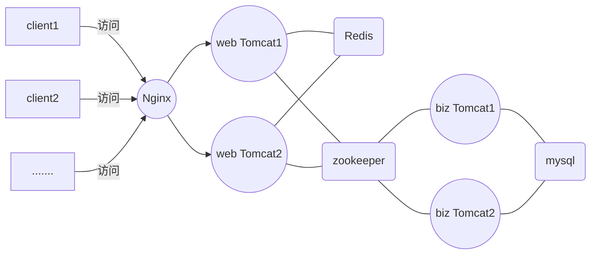

# 搭建基于Docker的分布式运行环境

[TOC]

## 一、前言

​	本文记录搭建Docker分布式运行环境的过程。

​	使用到的技术架构是Nginx作为反向代理，Tomcat作为web容器，zookeeper作为服务注册与发现，mysql作为持久化层，缓存使用Redis。为提高生产效率，使用jenkins和gitlab配合作为持续集成工具。

​	本文提供了一个分布式情况下的session管理解决方案。

​	架构图如下：



## 二、安装Docker

### 2.1  ubuntu下安装docker

- 查看系统版本

  docker需要64位操作系统，并且需要kernel内核至少在3.10以上。kernel3.10版本之前的系统缺少一些特性来运行docker容器。这些旧版本有些已知的bugs会导致数据丢失并且在一定条件下会频繁的故障。

  更新apt包索引

```shell
sudo apt-get update
```

- 安装最新版本的Docker CE

```shell
sudo apt-get install -y docker-ce
```

- 查看docker启动已经启动

```shell
systemctl status docker
```

- 启动docker

``` shell
sudo systemctl start docker
```

- 运行hello-world镜像

```shell
sudo docker run hello-world
```

```shell
sudo apt install docker.io
```

```shell
sudo addgroup --system docker
sudo adduser $USER docker
newgrp docker
```


## 三、构建自定义Tomcat镜像

​	由于docker hub上面的tomcat镜像不可以设置tomcat user，然后我们有需要设置tomcat帐号来给jenkins访问tomcat，所以需要自制一个tomcat，主要为了设置tomcat user。

​	新建一个文件`Dockerfile`（注意无文件后缀），内容为：

```dockerfile
# 基础镜像
FROM tomcat:8.0-jre8
# 作者信息
MAINTAINER zhanjixun <zhanjixun@qq.com>
# 定义工作路径
ENV WORK_PATH /usr/local/tomcat/config/
# 改写tomcat-users.xml文件
RUN echo '<?xml version='1.0' encoding='utf-8'?>\
<tomcat-users>\
	<role rolename="manager-gui"/>\
	<role rolename="manager-script"/>\
	<role rolename="manager-jmx"/>\
	<user username="tomcat" password="123456" roles="manager-gui,manager-script,manager-jmx" />\
</tomcat-users>' > $WORK_PATH/tomcat-users.xml
ENV WORK_PATH /usr/local/tomcat
```

构建docker镜像，运行构建镜像命令（注意命令后面有个点）：

```shell
docker build -t zhanjixun/tomcat:8.0-jre8 .
```

然后耐心等待成功之后查看刚刚生成的镜像：

``` shell
docker images
```

启动Tomcat容器，在本项目中，我们需要用到4个Tomcat容器，webTomcat 和 bizTomcat各两个。


## 四、启动Nginx


## 五、启动MySQL


## 六、启动Zookeeper


## 七、使用Dubbo-admin


## 八、安装Jenkins


## 九、安装gitlab代码仓库


## 十、创建项目工程及编写代码


## 十一、接入Redis

